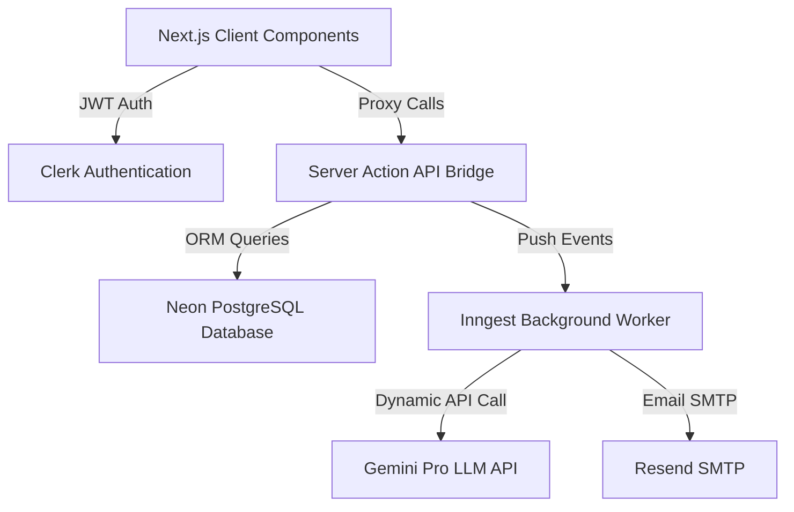
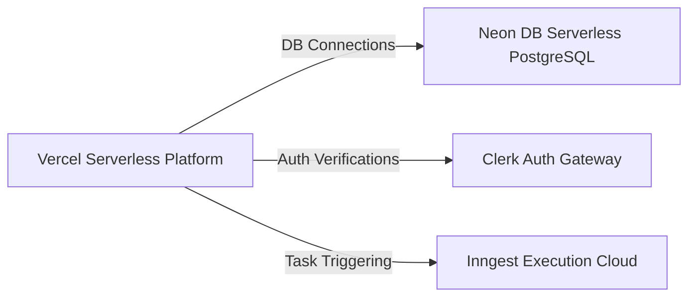
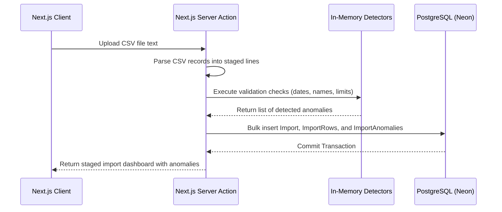

# Architectural System Overview

This document presents the high-level architecture, container maps, deployments, core data flows, and design principles of the Splitr platform.

---

## 🏛️ High-Level System Architecture

Splitr is built as a Next.js App Router application deployed on Vercel, integrating a PostgreSQL backend hosted on Neon DB, Clerk for user authentication, and Inngest for background cron jobs.

---

## 📐 Design & Invariant Rules

### 1. Separation of Client and Server Boundaries
* **Rule**: Client components must never access the database directly. They retrieve data and trigger mutations exclusively via Server Actions.
* **Implementation**: The [api-bridge.js](file:///c:/Users/manav/OneDrive/Desktop/ai-splitwise-clone/lib/api-bridge.js) maps the legacy Convex frontend calls (`useConvexQuery`, `useConvexMutation`) to Server Actions, preserving client structure.

### 2. Relational Schema Integrity
* **Rule**: All modifications to transactions, splits, memberships, and settlements must be wrapped in ACID transactions.
* **Implementation**: Uses Prisma's `$transaction` API inside [imports.js](file:///c:/Users/manav/OneDrive/Desktop/ai-splitwise-clone/lib/actions/imports.js) and [expenses.js](file:///c:/Users/manav/OneDrive/Desktop/ai-splitwise-clone/lib/actions/expenses.js) to prevent dirty reads and partial updates.

### 3. Currency Consistency (INR)
* **Rule**: The primary ledger calculations must be finalized in the group's base currency (INR).
* **Implementation**: Currencies are checked and converted at write-time using exchange rates stored in `CurrencyRate` to prevent temporal drift.

---

## 🗺️ Container & Deployment Diagrams

### 1. Physical Deployment Container

### 2. Logical Data Flows (CSV Import Workflow)

---

## 👁️ Observability & Reliability Strategies

### Current Implementation
* **Prisma Logging**: Queries are logged in console standard outputs (stdout) during non-production environments to capture slow queries or missing indexes.
* **Error Containment**: Network errors on background Inngest jobs (e.g. Gemini LLM key limits, Resend API throttles) are isolated, ensuring they do not affect Next.js request-response cycles.

### Future Evolution
* **Telemetry**: Integrate OpenTelemetry SDK to stream traces and span durations to an APM platform (e.g., Datadog or Axiom).
* **Alert Thresholds**: Configure alerts for Neon DB connection count exhaustion or database CPU utilization spikes (>80% for 5 minutes).
