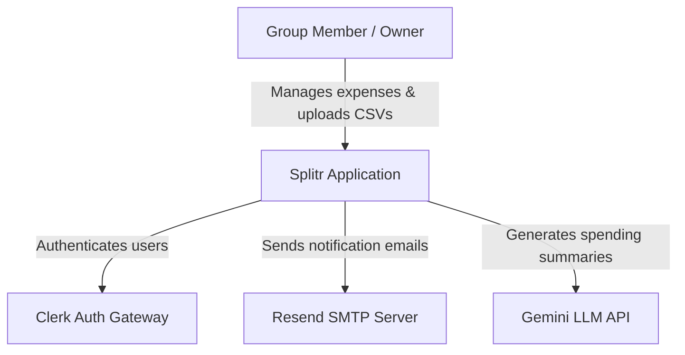
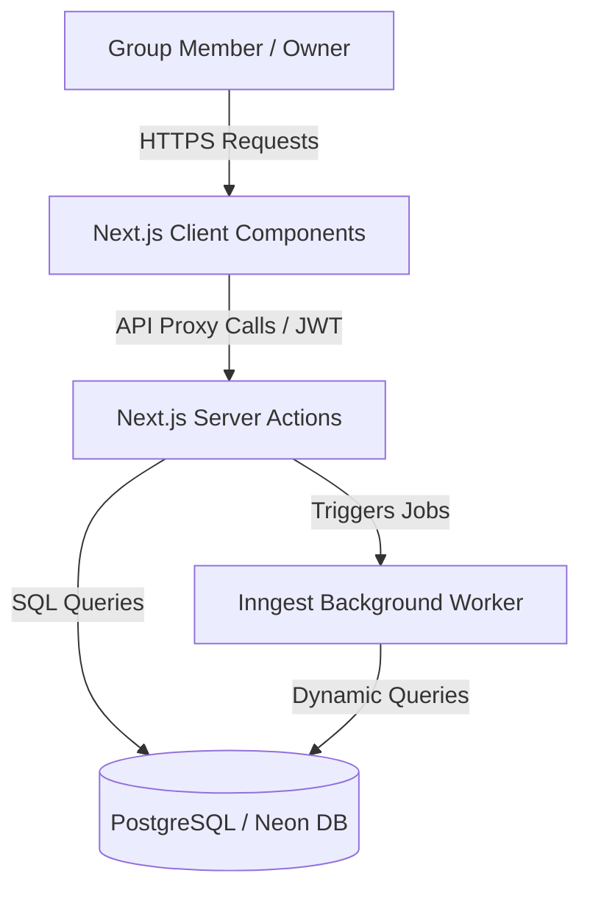
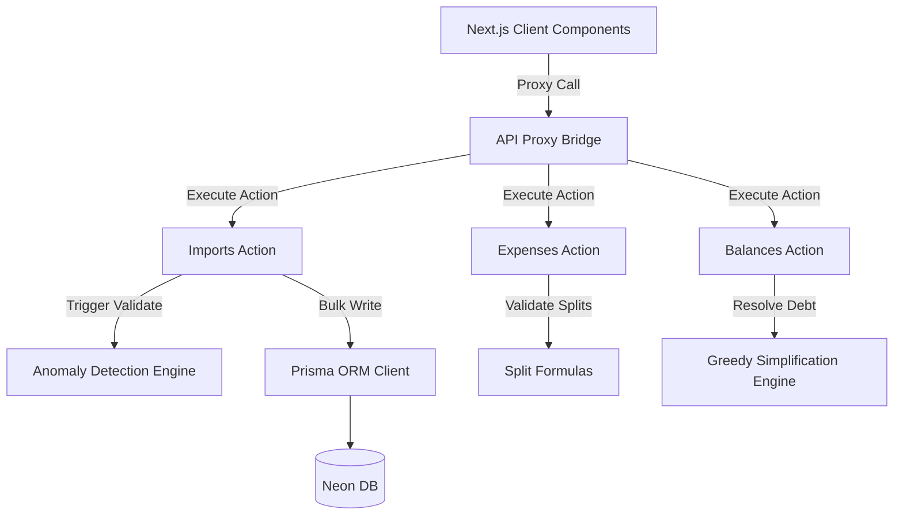

# C4 Architectural Model

This document outlines the system architecture of Splitr using the C4 model framework (Context, Container, Component, and Code).

---

## 🌎 Level 1: System Context Diagram

The Context Level shows how Splitr fits into the larger ecosystem, showing its interactions with users and third-party systems.

* **Splitr**: The core application, responsible for calculating splits, managing temporal memberships, auditing currencies, netting balances, and staging/committing CSV imports.
* **Clerk**: Third-party OAuth and JWT session management service.
* **Resend**: Transactional email service for payment reminders.
* **Gemini**: Large Language Model API for generating spending insights.

---

## 📦 Level 2: Container Diagram

The Container Level focuses on the technological high-level containers inside the Splitr boundaries.

* **Next.js Client Components (React)**: High-performance user interface running in the browser. Renders the CSV grid, interactive tables, and charts.
* **Next.js Server Actions**: Server-side API endpoints executing logic, performing authorization checks, and orchestrating transactions.
* **Inngest Background Worker**: Orchestrates delayed or recurring processes (crons, reminders, AI summaries).
* **Neon DB**: Serverless relational database holding users, expenses, settlements, group structures, and imports.

---

## 🧩 Level 3: Component Diagram

The Component Level breaks down the Next.js Server Actions and core engines within the backend layer.

* **API Proxy Bridge**: Resolves client dot-accessed calls into direct Server Actions.
* **Imports Action**: Staging, reviewing, and committing CSV pipelines.
* **Anomaly Detection Engine**: Isolated sub-detectors verifying structural and semantic CSV row constraints.
* **Expenses Action**: Handles manual split configuration inputs (percentages, exact shares).
* **Balances Action**: Resolves aggregate debts into optimized peer-to-peer payments.

---

## 💻 Level 4: Code Diagram

The Code Level shows how the codebase models are organized. The core directory layout mapping:

* **UI Components**:
  - Main Pages: [app/(main)/](file:///c:/Users/manav/OneDrive/Desktop/ai-splitwise-clone/app/(main)/)
  - Create Group Modals: [create-group-modal.jsx](file:///c:/Users/manav/OneDrive/Desktop/ai-splitwise-clone/app/(main)/contacts/components/create-group-modal.jsx)
  - Import Queue Page: [import/page.jsx](file:///c:/Users/manav/OneDrive/Desktop/ai-splitwise-clone/app/(main)/import/page.jsx)
* **Server-Side Handlers**:
  - API Proxies: [api-bridge.js](file:///c:/Users/manav/OneDrive/Desktop/ai-splitwise-clone/lib/api-bridge.js)
  - Server Actions: [lib/actions/](file:///c:/Users/manav/OneDrive/Desktop/ai-splitwise-clone/lib/actions/)
* **Logic Engines**:
  - Detectors List: [lib/import/detectors/index.js](file:///c:/Users/manav/OneDrive/Desktop/ai-splitwise-clone/lib/import/detectors/index.js)
  - Balance Solver: [lib/actions/balances.js](file:///c:/Users/manav/OneDrive/Desktop/ai-splitwise-clone/lib/actions/balances.js)
* **Background Processing**:
  - Scheduled Jobs: [lib/inngest/](file:///c:/Users/manav/OneDrive/Desktop/ai-splitwise-clone/lib/inngest/)
