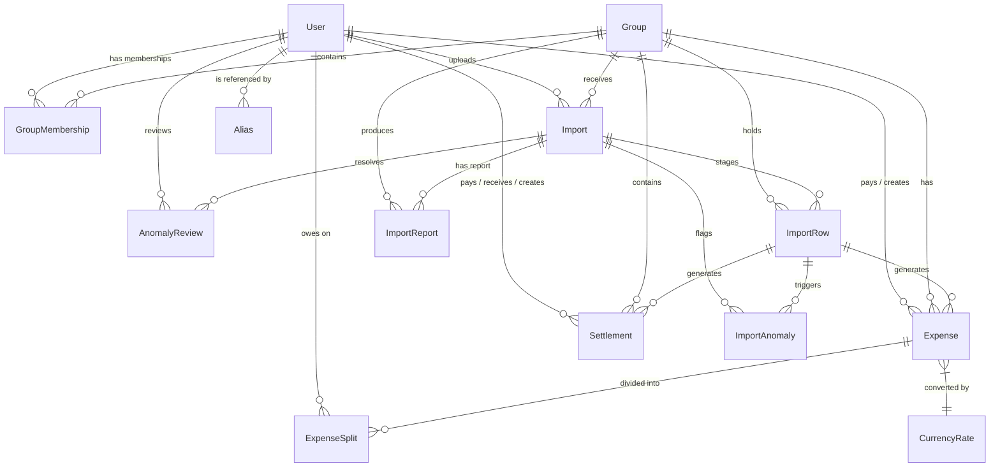

# Relational Database Design & Index Mapping

This document details the database architecture, Entity-Relationship (ER) layouts, indexes, query patterns, and lifecycle tracing within the Splitr system.

---

## 🗺️ Entity-Relationship (ER) Diagram



---

## ⚡ Index Optimization Matrix

Below are the key indexes configured in [schema.prisma](file:///c:/Users/manav/OneDrive/Desktop/ai-splitwise-clone/prisma/schema.prisma) and their corresponding target query execution paths.

| Table | Index Columns | Purpose & Query Path |
| :--- | :--- | :--- |
| **`Expense`** | `[groupId]` | Filters expenses belonging to a specific group (group dashboard feed). |
| **`Expense`** | `[paidByUserId, groupId]` | Speeds up calculations of individual user payments within a group. |
| **`Expense`** | `[groupId, date]` | Optimizes fetching expenses in chronological order (timeline views). |
| **`ExpenseSplit`** | `[userId]` | Fast indexing for global user debt queries across all groups. |
| **`ExpenseSplit`** | `[userId, expenseId]` | Resolves individual transaction balance netting lookups. |
| **`GroupMembership`** | `[groupId, userId]` | Performs instantaneous checks of participant memberships during split creation. |
| **`GroupMembership`** | `[groupId, joinedAt]` | Queries active members intersecting specific expense timestamps. |
| **`Alias`** | `[groupId, rawName]` | Speeds up lookups matching dirty name strings to registered Users. |
| **`CurrencyRate`** | `[fromCurrency, toCurrency, effectiveDate]` | Retrieves the closest historical conversion rate for non-base entries. |
| **`ImportRow`** | `[importId, rowNumber]` | Facilitates fast grid renderings of staged spreadsheets. |
| **`ImportAnomaly`** | `[importId, status]` | Filters unresolved anomalies blocking import commits. |

---

## 🗃️ Temporal Membership & Historical Auditing

### 1. Invariant Integrity Checking
To prevent temporal membership violations (e.g. logging an expense for a member before they joined), the system executes intersection checks:

```sql
-- Conceptual SQL validation execution query
SELECT * FROM "GroupMembership"
WHERE "groupId" = $1 
  AND "userId" = $2
  AND "joinedAt" <= $3
  AND ("leftAt" IS NULL OR "leftAt" >= $3);
```

### 2. CSV Import Tracking
Imports are structured using three distinct stages (`UPLOADED` -> `APPROVED` -> `COMMITTED`), tracked by audit timestamps (`createdAt`, `approvedAt`, `committedAt`). The linked IDs (`sourceImportId`, `sourceImportRowId`) on `Expense` and `Settlement` tables maintain historical tracing, allowing any transaction to be traced back to the line of the CSV that created it.
