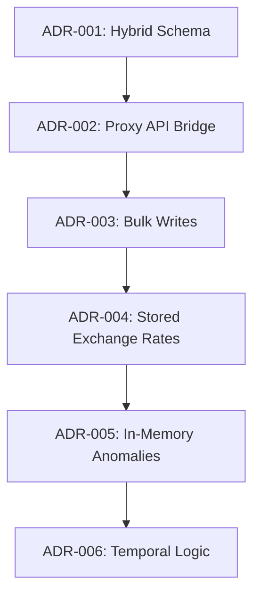

# Architectural Decision Log (ADR)

This document chronicles the major engineering decisions, tradeoffs, technical debt, and revisit criteria for Splitr's architecture.

---

---

## 🏛️ ADR-001: Hybrid Relational-JSON Schema Migration

* **Status**: Approved
* **Context**: Splitr was migrated from Convex (a NoSQL real-time document database) to PostgreSQL via Prisma ORM. The existing frontend code heavily assumed nested document shapes (e.g. nested lists of members or splits).
* **Options Considered**:
  1. **Option 1: Complete Normalization**. Deconstructing all nested objects into strict relational join tables and rebuilding all frontend data loading layers.
  2. **Option 2: Hybrid Relational-JSON Mapping**. Storing nested arrays in JSONB columns (for frontend compatibility) while concurrently writing rows to normalized relational tables (`GroupMembership` and `ExpenseSplit`) for database query optimizations.
* **Chosen Option**: **Option 2 (Hybrid Schema)**.
* **Tradeoffs & Consequences**:
  - *Pros*: Complete backwards compatibility with client code, minimizing refactoring regressions.
  - *Cons*: Write amplification (we write to both the JSON column and the relational table) and potential data drift if updates are not wrapped in transactional writes.
* **Technical Debt**: Duplicated representations of group members and splits must be kept synchronized.
* **Revisit Criteria**: Revisit if database size exceeds 50GB and JSON parsing becomes a storage/performance bottleneck.

---

## 🌉 ADR-002: Dynamic API Proxy Bridge

* **Status**: Approved
* **Context**: Next.js client pages imported queries and mutations using the Convex namespace `api.js`. Replacing this namespace directly with Next.js Server Actions would have required rewriting over 20 files.
* **Options Considered**:
  1. **Option 1: Manual Route Rewrite**. Rewriting all client files to directly invoke Next.js Server Actions.
  2. **Option 2: JS Proxy Interception**. Creating a dynamic JavaScript `Proxy` object that intercepts client-side calls to `api.*` and maps them to server-side action handlers.
* **Chosen Option**: **Option 2 (JS Proxy Interception)**.
* **Tradeoffs & Consequences**:
  - *Pros*: Kept the entire frontend untouched during migration, allowing rapid verification and zero regression risk.
  - *Cons*: Slight indirection overhead and dependency on dynamic reflection.
* **Technical Debt**: Relies on a custom wrapper [api-bridge.js](file:///c:/Users/manav/OneDrive/Desktop/ai-splitwise-clone/lib/api-bridge.js) which must be maintained.
* **Revisit Criteria**: Revisit if typescript autocomplete on server actions becomes a priority for the engineering team.

---

## ⚡ ADR-003: Bulk Ingestion Batching

* **Status**: Approved
* **Context**: Interactive database transactions over WAN to remote Neon DB timed out on large CSV uploads due to network round-trips from sequential loops.
* **Options Considered**:
  - **Option 1: Timeout Extension**. Raising the Prisma/Neon interactive transaction timeout limits.
  - **Option 2: Bulk batching writes**. Refactoring loops to write via `createMany` and `createManyAndReturn`.
* **Chosen Option**: **Option 2 (Bulk batching writes)**.
* **Tradeoffs & Consequences**:
  - *Pros*: Reduced database roundtrips from 170+ down to 3, cutting execution time from 30+ seconds to <0.5 seconds.
  - *Cons*: High memory consumption when caching hundreds of rows in-memory before bulk flushing.
* **Technical Debt**: Requires custom mapping arrays in memory.
* **Revisit Criteria**: Revisit if single CSV uploads exceed 100,000 rows (will require chunked streaming).

---

## 💸 ADR-004: Stored Exchange Rates for Currency Conversion

* **Status**: Approved
* **Context**: Transactions may be logged in foreign currencies (e.g. USD) and need to be normalized to base currency (INR) for balances.
* **Options Considered**:
  1. **Option 1: Dynamic Lookups**. Fetching dynamic rates at page load.
  2. **Option 2: Stored Conversions**. Running conversion at import/creation time and saving immutable conversion rates and base currency values directly onto the records.
* **Chosen Option**: **Option 2 (Stored Conversions)**.
* **Tradeoffs & Consequences**:
  - *Pros*: Ensures ledger immutability and reproducibility. Historical reports will not drift as current rates fluctuate.
  - *Cons*: Requires database fields for original currency, converted currency, original amount, converted amount, and exchange rate.
* **Technical Debt**: None; standard practice for accounting ledgers.
* **Revisit Criteria**: None.

---

## 🔍 ADR-005: In-Memory Anomaly Verification Rules

* **Status**: Approved
* **Context**: CSV validation anomalies must be caught, stored, and resolved by the user.
* **Options Considered**:
  1. **Option 1: DB Constraints / Triggers**. Validating data integrity inside PostgreSQL triggers.
  2. **Option 2: In-Memory Rules Engine**. Executing rules in isolated javascript modules prior to saving.
* **Chosen Option**: **Option 2 (In-Memory Rules Engine)**.
* **Tradeoffs & Consequences**:
  - *Pros*: Modularity, unit-testability, and lower database workload.
  - *Cons*: Risk of bad data bypass if manual SQL scripts write directly to database tables.
* **Technical Debt**: Core rules are implemented in [lib/import/detectors/](file:///c:/Users/manav/OneDrive/Desktop/ai-splitwise-clone/lib/import/detectors/) and must keep pace with any schema changes.
* **Revisit Criteria**: Revisit if multiple external clients (e.g., mobile apps) start writing to the DB directly.

---

## 📅 ADR-006: Temporal Membership Interval Checks

* **Status**: Approved
* **Context**: Expenses must not be split with members who were not part of the group when the expense occurred.
* **Options Considered**:
  1. **Option 1: Dynamic check at split creation**. Checking the memberships table whenever a split is created.
  2. **Option 2: Soft enforcement**. Allowing any splits but highlighting temporal violations as warnings.
* **Chosen Option**: **Option 1 (Dynamic check at split creation)**.
* **Tradeoffs & Consequences**:
  - *Pros*: Hard integrity of splits.
  - *Cons*: Prevents retrospective logging of expenses if user membership dates are not updated first.
* **Technical Debt**: Requires accurate joinedAt/leftAt fields on the `GroupMembership` table.
* **Revisit Criteria**: Revisit if users demand the ability to backdate expenses before their official join date.

---

## 📥 ADR-007: Staged Import Architecture

* **Status**: Approved
* **Context**: The assignment required an import pipeline that catches data problems before they corrupt the live ledger. The raw CSV dataset (`goa_trip_expenses.csv`) contained 15 anomalies across 12 rows — duplicates, repayments, membership violations, and foreign currencies — none of which should reach the `Expense` or `Settlement` tables without human review.
* **Options Considered**:
  1. **Option 1: Direct Insertion**. Parse the CSV and immediately write every row as an `Expense` record. Validate constraints in-database after the fact, then rollback failures.
  2. **Option 2: Stage-then-Commit (Chosen)**. Write every row to an intermediate `ImportRow` table first (`status: "uploaded"`). Run anomaly detection in memory. Gate the final commit behind an `approved` status check. Only write to `Expense` and `Settlement` after all blocking anomalies are resolved.
* **Chosen Option**: **Option 2 (Stage-then-Commit)**.
* **Tradeoffs & Consequences**:
  - *Pros*: Ledger integrity is never violated. Users can review, correct, skip, or reclassify rows before committing. Import sessions are resumable — a user can close the browser and return later.
  - *Cons*: Two database writes per row (staged + committed). Adds `Import`, `ImportRow`, `ImportAnomaly`, and `AnomalyReview` tables to the schema.
* **Implementation Reference**: The `upload()` function in [imports.js](file:///c:/Users/manav/OneDrive/Desktop/ai-splitwise-clone/lib/actions/imports.js) stages rows via `importRow.createManyAndReturn` inside a 30s transaction. The `commit()` function (60s transaction) then reads only rows with `status: "imported"` or unprocessed rows, skipping those already committed (`row.createdExpenseId || row.createdSettlementId`).
* **Technical Debt**: The two-write pattern means `ImportRow` records accumulate indefinitely unless a cleanup job purges old committed imports.
* **Revisit Criteria**: Revisit if import volumes scale to the point where staging tables create storage pressure (>10 million staged rows).

---

## 🧑‍⚖️ ADR-008: Human Approval Workflow for Anomalies

* **Status**: Approved
* **Context**: The anomaly detection engine identifies 11 distinct problem types with varying severity levels (`blocking`, `warning`, `info`). The question was whether the system should auto-correct or auto-skip problematic rows, or require a human decision on every blocking issue.
* **Options Considered**:
  1. **Option 1: Automatic Correction**. Apply rule-based fixes automatically — e.g. auto-default currency to INR, auto-skip exact duplicates, auto-accept membership exceptions — and commit without human input.
  2. **Option 2: Human Approval Gate (Chosen)**. Persist every anomaly as an `ImportAnomaly` record with `status: "open"`. Block `commit()` execution at the server level if any `blocking` anomaly remains `open`. Require the reviewer to call `reviewAnomaly()` for each issue.
* **Chosen Option**: **Option 2 (Human Approval Gate)**.
* **Tradeoffs & Consequences**:
  - *Pros*: Financial data corrections always have an audit trail in `AnomalyReview`. Every skip or reclassification is time-stamped and attributed to a specific reviewer ID. Prevents silent auto-corrections that are undetectable after the fact.
  - *Cons*: Slower throughput for large files with many anomalies. For the Goa dataset, 15 individual review decisions were required.
* **Implementation Reference**: The `approve()` function [imports.js L541–L564](file:///c:/Users/manav/OneDrive/Desktop/ai-splitwise-clone/lib/actions/imports.js) queries `importAnomaly.findMany({ where: { status: "open", severity: "blocking" } })` and throws `"Resolve N blocking anomalies before approval"` if any are found. The `reviewAnomaly()` function [L488–L539](file:///c:/Users/manav/OneDrive/Desktop/ai-splitwise-clone/lib/actions/imports.js) decrements `blockingCount` on the parent `Import` after each decision.
* **Technical Debt**: Warning-level anomalies (`CURRENCY_CONVERSION_REQUIRED`, `GUEST_PARTICIPANT`, `NON_STANDARD_SPLIT_TYPE`) are not currently forced to be reviewed — they are committed if the blocking gate passes. This is intentional but means some data corrections happen silently.
* **Revisit Criteria**: Revisit if regulatory requirements demand explicit acknowledgment of every warning-level anomaly, not just blocking ones.

---

## 📊 ADR-009: Derived (On-Demand) Balance Calculation

* **Status**: Approved
* **Context**: After committing expenses and settlements to the database, the Balances page needs to show each member's net position and the minimum set of payments needed to clear all debts. The decision was whether to pre-compute and persist a `Balance` record after every write, or derive it on every read.
* **Options Considered**:
  1. **Option 1: Persisted Balance Records**. Maintain a `Balance` table updated via database triggers or post-write hooks whenever an `Expense`, `ExpenseSplit`, or `Settlement` is created or modified.
  2. **Option 2: On-Demand Aggregation (Chosen)**. Derive balances at query time by aggregating all `ExpenseSplit` and `Settlement` records for the group, computing net positions, and running the greedy simplification algorithm over the result.
* **Chosen Option**: **Option 2 (On-Demand Aggregation)**.
* **Tradeoffs & Consequences**:
  - *Pros*: Always correct — no cache invalidation or trigger logic required. Works correctly even after retroactive edits to expenses or settlements. No additional schema model.
  - *Cons*: Latency scales with group size. Every balance page load issues one `expense.findMany`, one `settlement.findMany`, and N `expenseSplit.findMany` queries (one per expense). For the current dataset this is acceptable; at thousands of expenses it becomes a bottleneck.
* **Implementation Reference**: `getGroupBalances()` in [balances.js L52–L111](file:///c:/Users/manav/OneDrive/Desktop/ai-splitwise-clone/lib/actions/balances.js) reads all expenses and settlements, accumulates net positions into a `net: { userId: amount }` map, then calls `optimizeSettlements()` [L211–L239](file:///c:/Users/manav/OneDrive/Desktop/ai-splitwise-clone/lib/actions/balances.js) which runs a greedy O(N log N) creditor-debtor pairing algorithm to produce the minimum payment set.
* **Technical Debt**: The current implementation issues a separate `expenseSplit.findMany` query per expense inside a `for` loop, creating an N+1 query pattern. This should be replaced with a single join query at scale.
* **Revisit Criteria**: Revisit when a group accumulates more than 1,000 expenses and balance page latency exceeds 1.5 seconds. Solution: introduce a Redis-backed cache layer (e.g. Upstash) invalidated on every write to `Expense` or `Settlement`.

---

## 🏷️ ADR-010: Alias Resolution Strategy for Participant Names

* **Status**: Approved
* **Context**: The `goa_trip_expenses.csv` dataset contained name variants for the same people: `priya`, `Priya S`, `rohan ` (trailing space), and `Dev's friend Kabir`. Without normalization, each variant would create a separate unknown participant and fail to link splits to existing `User` records.
* **Options Considered**:
  1. **Option 1: Reject Unrecognized Names**. Block any row where `paid_by` or `split_with` contains a name not found verbatim in the group's user list. Require the uploader to pre-register every name variant.
  2. **Option 2: Deterministic Canonical Map (Chosen)**. Define a `canonicalName()` function that maps known variant strings to their canonical equivalents at detection time. Persist each raw→canonical mapping as an `Alias` record. Flag as `NAME_ALIAS` warning so the reviewer sees every resolution before commit.
  3. **Option 3: Fuzzy String Matching**. Compute Jaro-Winkler or Levenshtein distances at runtime for any name not in the group list. Auto-resolve above a confidence threshold.
* **Chosen Option**: **Option 2 (Deterministic Canonical Map)**.
* **Tradeoffs & Consequences**:
  - *Pros*: Deterministic and auditable. Every alias resolution is visible in the `Alias` table with a `confidence` score (0.76 for all current resolutions). No false positives from fuzzy matching.
  - *Cons*: Requires manual upkeep of the canonical map inside [aliasDetector.js](file:///c:/Users/manav/OneDrive/Desktop/ai-splitwise-clone/lib/import/detectors/aliasDetector.js) for each new group's name variants. Does not handle arbitrary spelling errors.
* **Implementation Reference**: `canonicalName()` in [aliasDetector.js L9–L20](file:///c:/Users/manav/OneDrive/Desktop/ai-splitwise-clone/lib/import/detectors/aliasDetector.js) maps `"priya s"` → `"Priya"`, `"priya"` → `"Priya"`, `"rohan"` → `"Rohan"`, `"dev's friend kabir"` → `"Kabir"`. All other names receive title-case normalization. `detectAliasAnomalies()` fires a `NAME_ALIAS` warning with `confidenceScore: 0.76` whenever `rawName !== canonicalName(rawName)`.
* **Technical Debt**: The canonical map is hard-coded per detector file rather than sourced from the `Alias` database table. If Group A maps "Priya S" → "Priya" and Group B uses "Priya S" for a different person, the current detector has no group-scoped isolation.
* **Revisit Criteria**: Revisit when supporting multiple groups with overlapping participant name spaces. Solution: make `canonicalName()` accept a group-scoped `Alias` lookup from the database rather than a static map.

---

## 👤 ADR-011: Temporary and Guest Membership Handling

* **Status**: Approved
* **Context**: The imported dataset included participants outside the standard permanent group: **Kabir** appeared as a one-day trip guest on row 11, and **Sam** had expenses logged before his official April 8 join date. The system needed to handle temporary participants without permanently polluting the group's long-term membership roster.
* **Options Considered**:
  1. **Option 1: Reject Rows with Non-Members**. Block any row referencing a participant without an active `GroupMembership` record. Require the operator to manually add them before importing.
  2. **Option 2: Auto-Enroll Permanently**. Add every encountered name as a permanent group member with no end date. Simplest path, but creates polluted membership records.
  3. **Option 3: Temporary Membership Windows (Chosen)**. Create `GroupMembership` records with explicit `joinedAt` / `leftAt` bounds. Guests (Kabir) get a one-day window matching the expense date. Membership violations (Sam, Meera) generate blocking anomalies that the reviewer must explicitly approve or skip.
* **Chosen Option**: **Option 3 (Temporary Membership Windows)**.
* **Tradeoffs & Consequences**:
  - *Pros*: Temporal integrity is preserved. Historical queries for "who was in the group on date X" return correct results. Guest enrollments expire automatically via `leftAt` rather than persisting forever.
  - *Cons*: `GroupMembership` table grows with one-day records for each guest appearance. Membership window definitions for known participants (Meera, Sam, Dev) are currently hard-coded in the detector.
* **Implementation Reference**: In [membershipDetector.js](file:///c:/Users/manav/OneDrive/Desktop/ai-splitwise-clone/lib/import/detectors/membershipDetector.js): Kabir gets `GUEST_PARTICIPANT` (warning) with `joinedAt = rowDate`, `leftAt = rowDate + 86400000ms`. Sam and Meera get `MEMBERSHIP_VIOLATION` (blocking). During `commit()` in [imports.js L660–L703](file:///c:/Users/manav/OneDrive/Desktop/ai-splitwise-clone/lib/actions/imports.js), `trackAndEnsureMembershipLocal()` checks for interval overlap before adding a new `GroupMembership` to the `membershipsToCreate` array, then bulk-inserts via `groupMembership.createMany`.
* **Technical Debt**: Membership window boundaries for Meera, Sam, and Dev are embedded as date literals in `membershipWindowForName()` inside [membershipDetector.js L5–L11](file:///c:/Users/manav/OneDrive/Desktop/ai-splitwise-clone/lib/import/detectors/membershipDetector.js). A production system should derive these from the live `GroupMembership` database records instead.
* **Revisit Criteria**: Revisit immediately when extending to a second group. The hard-coded participant names will produce false positives for any group where members happen to share those names.

---

## 📋 ADR-012: Immutable Import Report Generation

* **Status**: Approved
* **Context**: The assignment specification required a deliverable import report listing every detected anomaly, the action taken, and the final row counts. The question was where and when to generate this report, and whether it should be regenerated on demand or persisted once at commit time.
* **Options Considered**:
  1. **Option 1: Live Report on Every Page Load**. Dynamically join `ImportAnomaly`, `AnomalyReview`, and `ImportRow` at query time whenever the report is requested. Always current, but expensive for large imports.
  2. **Option 2: Static Markdown Export Only**. Generate a one-time markdown file and save it to the repository. No database persistence.
  3. **Option 3: Persisted `ImportReport` Record (Chosen)**. At the end of the `commit()` transaction, assemble a comprehensive `summaryJson` object containing row counts, the full anomaly list with status, all user decisions with timestamps, currency conversions, and settlement reclassifications. Write this as a single `ImportReport` row in the database. Also export a static markdown copy to `IMPORT_REPORT.md`.
* **Chosen Option**: **Option 3 (Persisted `ImportReport` with static export)**.
* **Tradeoffs & Consequences**:
  - *Pros*: The report is a point-in-time snapshot that does not change if records are later edited. Satisfies the assignment's requirement for a generated import report as a deliverable. Queryable via the UI (`importReport.findFirst({ where: { importId } })`). Also available as a static file without requiring a live database connection.
  - *Cons*: If an import is partially rolled back or anomalies are re-reviewed after commit, the persisted report becomes stale. The system performs an upsert (update if exists, create if not) to handle re-commits.
* **Implementation Reference**: `reportSummary` assembly at [imports.js L984–L1007](file:///c:/Users/manav/OneDrive/Desktop/ai-splitwise-clone/lib/actions/imports.js) builds the JSON structure inside the same 60s `$transaction` as the expense creation. The upsert logic at [L1009–L1028](file:///c:/Users/manav/OneDrive/Desktop/ai-splitwise-clone/lib/actions/imports.js) checks `importReport.findFirst({ where: { importId } })` and calls either `update` or `create`. The static copy is stored at [IMPORT_REPORT.md](file:///c:/Users/manav/OneDrive/Desktop/ai-splitwise-clone/IMPORT_REPORT.md).
* **Technical Debt**: The `summaryJson.rowsProcessed` field is sourced from `importDoc.rowCount`, which is set at staging time and may differ from the actual row count at commit time if rows are added or removed between stages. The `goa_trip_expenses.csv` import report shows `rowsProcessed: 12` and `rowsImported: 11` correctly for the committed session.
* **Revisit Criteria**: Revisit if post-commit edits (expense corrections, retroactive anomaly re-reviews) need to trigger report regeneration. Solution: expose a `regenerateReport({ importId })` server action and call it from a UI button on the import detail screen.
