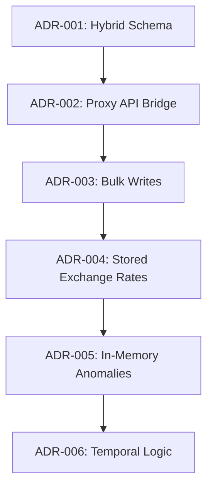

# Architectural Decision Log (ADR)

This document chronicles the major engineering decisions, tradeoffs, technical debt, and revisit criteria for Splitr's architecture.

---

---

## 🏛️ ADR-001: Hybrid Relational-JSON Schema Migration

* **Status**: Approved
* **Context**: Splitr was migrated from Convex (a NoSQL real-time document database) to PostgreSQL via Prisma ORM. The existing frontend code heavily assumed nested document shapes (e.g. nested lists of members or splits).
* **Options Considered**:
  1. **Option 1: Complete Normalization**. Deconstructing all nested objects into strict relational join tables and rebuilding all frontend data loading layers.
  2. **Option 2: Hybrid Relational-JSON Mapping**. Storing nested arrays in JSONB columns (for frontend compatibility) while concurrently writing rows to normalized relational tables (`GroupMembership` and `ExpenseSplit`) for database query optimizations.
* **Chosen Option**: **Option 2 (Hybrid Schema)**.
* **Tradeoffs & Consequences**:
  - *Pros*: Complete backwards compatibility with client code, minimizing refactoring regressions.
  - *Cons*: Write amplification (we write to both the JSON column and the relational table) and potential data drift if updates are not wrapped in transactional writes.
* **Technical Debt**: Duplicated representations of group members and splits must be kept synchronized.
* **Revisit Criteria**: Revisit if database size exceeds 50GB and JSON parsing becomes a storage/performance bottleneck.

---

## 🌉 ADR-002: Dynamic API Proxy Bridge

* **Status**: Approved
* **Context**: Next.js client pages imported queries and mutations using the Convex namespace `api.js`. Replacing this namespace directly with Next.js Server Actions would have required rewriting over 20 files.
* **Options Considered**:
  1. **Option 1: Manual Route Rewrite**. Rewriting all client files to directly invoke Next.js Server Actions.
  2. **Option 2: JS Proxy Interception**. Creating a dynamic JavaScript `Proxy` object that intercepts client-side calls to `api.*` and maps them to server-side action handlers.
* **Chosen Option**: **Option 2 (JS Proxy Interception)**.
* **Tradeoffs & Consequences**:
  - *Pros*: Kept the entire frontend untouched during migration, allowing rapid verification and zero regression risk.
  - *Cons*: Slight indirection overhead and dependency on dynamic reflection.
* **Technical Debt**: Relies on a custom wrapper [api-bridge.js](file:///c:/Users/manav/OneDrive/Desktop/ai-splitwise-clone/lib/api-bridge.js) which must be maintained.
* **Revisit Criteria**: Revisit if typescript autocomplete on server actions becomes a priority for the engineering team.

---

## ⚡ ADR-003: Bulk Ingestion Batching

* **Status**: Approved
* **Context**: Interactive database transactions over WAN to remote Neon DB timed out on large CSV uploads due to network round-trips from sequential loops.
* **Options Considered**:
  - **Option 1: Timeout Extension**. Raising the Prisma/Neon interactive transaction timeout limits.
  - **Option 2: Bulk batching writes**. Refactoring loops to write via `createMany` and `createManyAndReturn`.
* **Chosen Option**: **Option 2 (Bulk batching writes)**.
* **Tradeoffs & Consequences**:
  - *Pros*: Reduced database roundtrips from 170+ down to 3, cutting execution time from 30+ seconds to <0.5 seconds.
  - *Cons*: High memory consumption when caching hundreds of rows in-memory before bulk flushing.
* **Technical Debt**: Requires custom mapping arrays in memory.
* **Revisit Criteria**: Revisit if single CSV uploads exceed 100,000 rows (will require chunked streaming).

---

## 💸 ADR-004: Stored Exchange Rates for Currency Conversion

* **Status**: Approved
* **Context**: Transactions may be logged in foreign currencies (e.g. USD) and need to be normalized to base currency (INR) for balances.
* **Options Considered**:
  1. **Option 1: Dynamic Lookups**. Fetching dynamic rates at page load.
  2. **Option 2: Stored Conversions**. Running conversion at import/creation time and saving immutable conversion rates and base currency values directly onto the records.
* **Chosen Option**: **Option 2 (Stored Conversions)**.
* **Tradeoffs & Consequences**:
  - *Pros*: Ensures ledger immutability and reproducibility. Historical reports will not drift as current rates fluctuate.
  - *Cons*: Requires database fields for original currency, converted currency, original amount, converted amount, and exchange rate.
* **Technical Debt**: None; standard practice for accounting ledgers.
* **Revisit Criteria**: None.

---

## 🔍 ADR-005: In-Memory Anomaly Verification Rules

* **Status**: Approved
* **Context**: CSV validation anomalies must be caught, stored, and resolved by the user.
* **Options Considered**:
  1. **Option 1: DB Constraints / Triggers**. Validating data integrity inside PostgreSQL triggers.
  2. **Option 2: In-Memory Rules Engine**. Executing rules in isolated javascript modules prior to saving.
* **Chosen Option**: **Option 2 (In-Memory Rules Engine)**.
* **Tradeoffs & Consequences**:
  - *Pros*: Modularity, unit-testability, and lower database workload.
  - *Cons*: Risk of bad data bypass if manual SQL scripts write directly to database tables.
* **Technical Debt**: Core rules are implemented in [lib/import/detectors/](file:///c:/Users/manav/OneDrive/Desktop/ai-splitwise-clone/lib/import/detectors/) and must keep pace with any schema changes.
* **Revisit Criteria**: Revisit if multiple external clients (e.g., mobile apps) start writing to the DB directly.

---

## 📅 ADR-006: Temporal Membership Interval Checks

* **Status**: Approved
* **Context**: Expenses must not be split with members who were not part of the group when the expense occurred.
* **Options Considered**:
  1. **Option 1: Dynamic check at split creation**. Checking the memberships table whenever a split is created.
  2. **Option 2: Soft enforcement**. Allowing any splits but highlighting temporal violations as warnings.
* **Chosen Option**: **Option 1 (Dynamic check at split creation)**.
* **Tradeoffs & Consequences**:
  - *Pros*: Hard integrity of splits.
  - *Cons*: Prevents retrospective logging of expenses if user membership dates are not updated first.
* **Technical Debt**: Requires accurate joinedAt/leftAt fields on the `GroupMembership` table.
* **Revisit Criteria**: Revisit if users demand the ability to backdate expenses before their official join date.
