```mermaid
flowchart LR
    A[ADR-001\nHybrid Schema] --> B[ADR-002\nProxy Bridge]
    B --> C[ADR-003\nBatch Writes]
    C --> D[ADR-004\nStored Rates]
    D --> E[ADR-005\nIn-Memory Rules]
    E --> F[ADR-006\nTemporal Checks]
    F --> G[ADR-007\nStaged Import]
    G --> H[ADR-008\nApproval Gate]
    H --> I[ADR-009\nOn-Demand Balances]
    I --> J[ADR-010\nAlias Map]
    J --> K[ADR-011\nGuest Membership]
    K --> L[ADR-012\nImport Report]
```

# DECISIONS.md — Architectural Decision Records

Engineering decisions, tradeoffs, and revisit criteria for the Splitr codebase. Each ADR documents the problem context, options evaluated, the chosen approach, and known technical debt.

---

---

## ADR-001 — Hybrid Relational-JSON Schema

**Status**: Approved

### Context

Splitr was migrated mid-project from Convex (a NoSQL document database) to PostgreSQL via Prisma. Frontend components were written against deeply nested document shapes — embedded member lists, embedded split arrays — which are natural in Convex but have no direct equivalent in a relational schema.

### Options Evaluated

**Option A — Full normalization**: Decompose every nested structure into strict relational join tables and rewrite all data-loading logic in the frontend.

**Option B — Hybrid JSONB + relational tables**: Retain JSONB columns on `Group` (for the embedded `members` array) and `Expense` (for the legacy `splits` field) to preserve frontend compatibility, while simultaneously writing normalized rows to `GroupMembership` and `ExpenseSplit` for query performance.

### Decision

**Option B** was chosen. The hybrid approach maintained zero frontend regressions during the database migration.

### Tradeoffs

| | Detail |
|---|---|
| ✅ Benefit | Full backward compatibility with existing client code; no frontend rewrites required |
| ⚠️ Cost | Write amplification: every member or split update must write to both the JSONB column and the relational table; these must be kept in sync inside a single transaction to prevent drift |

### Technical Debt

Dual representations of group members and expense splits. Any write path that bypasses the transactional wrapper risks divergence between JSONB and relational state.

### Revisit Criteria

Revisit if the database exceeds 50 GB and JSONB column size becomes a storage or query performance bottleneck.

---

## ADR-002 — Dynamic API Proxy Bridge

**Status**: Approved

### Context

All client pages imported queries and mutations using Convex's `api.*` namespace (e.g. `api.users.getCurrentUser`). Replacing these references with direct Next.js Server Action imports would have required modifying more than 20 files, each with its own calling convention and argument shape.

### Options Evaluated

**Option A — Manual rewrite**: Update every client file to call Next.js Server Actions directly.

**Option B — JavaScript Proxy interception**: Create a `Proxy` object in `convex/_generated/api.js` that traps any property access on `api.*` and resolves it dynamically to the corresponding handler in `lib/api-bridge.js`.

### Decision

**Option B** was chosen. The proxy layer preserved the existing calling convention across all client files with no frontend changes.

### Tradeoffs

| | Detail |
|---|---|
| ✅ Benefit | Entire frontend left untouched during migration; zero regression risk; rapid iterative verification |
| ⚠️ Cost | Runtime indirection overhead; relies on dynamic reflection rather than static imports; not TypeScript-safe |

### Technical Debt

The custom `api-bridge.js` mapping layer must be updated whenever a new server action is added or an existing one is renamed.

### Revisit Criteria

Revisit if the team prioritizes TypeScript autocomplete and type-safe server action calls — at that point a full direct-import migration becomes worthwhile.

---

## ADR-003 — Bulk Write Batching for CSV Staging

**Status**: Approved

### Context

Early versions of the CSV staging pipeline used sequential `await tx.importRow.create()` calls inside a Prisma interactive transaction. Over a WAN connection to Neon DB, each round-trip added latency that compounded linearly with row count. Any CSV with more than 12 rows triggered Prisma error `P2028` (`Transaction already closed`).

### Options Evaluated

**Option A — Raise transaction timeout**: Increase the Prisma and Neon interactive transaction timeout limits to accommodate the sequential writes.

**Option B — Batch write refactor**: Accumulate all staged row objects in memory, then flush them in a single `importRow.createManyAndReturn` call, with anomalies written in a subsequent `importAnomaly.createMany` call.

### Decision

**Option B** was chosen. Batching reduced the number of database round-trips from 170+ to 3 per import session.

### Tradeoffs

| | Detail |
|---|---|
| ✅ Benefit | Execution time dropped from 30+ seconds to under 0.5 seconds; eliminates `P2028` timeout errors entirely |
| ⚠️ Cost | All row objects must be held in memory simultaneously before the flush; memory consumption scales with CSV size |

### Technical Debt

In-memory accumulation arrays. For very large files this could create GC pressure in the serverless function runtime.

### Revisit Criteria

Revisit if CSV uploads regularly exceed 100,000 rows. Solution: stream the CSV in chunks and flush each chunk independently rather than accumulating the entire file.

---

## ADR-004 — Stored Exchange Rates for Currency Conversion

**Status**: Approved

### Context

Expenses may be logged in foreign currencies (USD, EUR, etc.) and must be normalized to the group base currency (INR) for balance calculations. The question was whether to look up live rates at query time or compute and store the conversion at write time.

### Options Evaluated

**Option A — Dynamic rate lookup**: Fetch the current exchange rate at balance calculation time and convert on the fly.

**Option B — Immutable stored conversion**: At import or expense creation time, retrieve the applicable rate, perform the conversion, and persist `originalAmount`, `originalCurrency`, `exchangeRate`, and `convertedAmount` directly on the `Expense` record.

### Decision

**Option B** was chosen, consistent with standard double-entry accounting practice.

### Tradeoffs

| | Detail |
|---|---|
| ✅ Benefit | Ledger is immutable and reproducible; historical reports remain stable as market rates fluctuate |
| ⚠️ Cost | Additional columns required on `Expense` and `Settlement`; slightly more complex write logic |

### Technical Debt

None. Storing conversion metadata at write time is a well-established accounting pattern.

### Revisit Criteria

None identified.

---

## ADR-005 — In-Memory Anomaly Detection Rules Engine

**Status**: Approved

### Context

CSV rows require validation against 11 distinct rule categories before any data is written to the production ledger. The question was whether to enforce these rules at the database level (constraints, triggers) or in application code before the write.

### Options Evaluated

**Option A — Database constraints and triggers**: Encode validation logic as PostgreSQL check constraints or trigger functions that fire on insert.

**Option B — In-memory JavaScript rules engine**: Run all validation logic in isolated detector modules (`lib/import/detectors/`) against the in-memory staged row array before any database writes occur.

### Decision

**Option B** was chosen. Application-layer validation gives more control, better error messages, and is easier to test in isolation.

### Tradeoffs

| | Detail |
|---|---|
| ✅ Benefit | Each detector is an independent module; fully unit-testable; no DB workload during validation; rich anomaly metadata (type, severity, confidence, suggested action) that DB triggers cannot easily produce |
| ⚠️ Cost | Rules run only through the application layer; raw SQL inserts bypassing the API would circumvent all validation |

### Technical Debt

Detector modules in `lib/import/detectors/` must be updated in sync with any schema changes. If the `Expense` or `GroupMembership` fields change, the corresponding detector logic must change too.

### Revisit Criteria

Revisit if additional write clients (mobile apps, third-party integrations) connect directly to the database and need enforcement guarantees independent of the application layer.

---

## ADR-006 — Blocking Temporal Membership Validation

**Status**: Approved

### Context

Expenses must only be split with members who were active in the group on the date the expense occurred. A participant who joined after an expense date, or who left before it, should not appear as a debtor for that transaction.

### Options Evaluated

**Option A — Hard enforcement at split creation**: Check `GroupMembership.joinedAt` and `leftAt` against the expense date during import and block rows with violations.

**Option B — Soft warning only**: Allow any split regardless of membership window but surface a warning to the reviewer.

### Decision

**Option A** was chosen. Financial integrity of the ledger requires that splits reflect actual participation at the time of the expense.

### Tradeoffs

| | Detail |
|---|---|
| ✅ Benefit | Hard integrity guarantee; balances always reflect who was actually present |
| ⚠️ Cost | Blocks retrospective expense logging when membership dates have not been updated first; reviewer must explicitly approve exceptions |

### Technical Debt

Depends on accurate `joinedAt` and `leftAt` values in `GroupMembership`. Stale membership records will produce false violations.

### Revisit Criteria

Revisit if there is strong user demand to backdate expenses to periods before a participant's official join date without an explicit exception approval.

---

## ADR-007 — Stage-then-Commit Import Architecture

**Status**: Approved

### Context

The assignment required a CSV import pipeline that isolates data problems before they reach the production ledger. The sample dataset (`goa_trip_expenses.csv`) contained 15 anomalies across 12 rows — exact duplicates, repayment rows, membership violations, and foreign currencies — none of which should bypass human review.

### Options Evaluated

**Option A — Direct insertion**: Parse CSV rows and write them immediately as `Expense` records. Roll back on constraint failure.

**Option B — Stage-then-commit**: Write every CSV row to an intermediate `ImportRow` table first. Run anomaly detection in memory. Block the final commit until all blocking anomalies are resolved via `AnomalyReview`. Only write to `Expense` and `Settlement` after the `Import` status reaches `"approved"`.

### Decision

**Option B** was chosen.

### Tradeoffs

| | Detail |
|---|---|
| ✅ Benefit | Ledger never receives unreviewed data; users can close the browser and resume an in-progress review session; every correction is timestamped and attributed |
| ⚠️ Cost | Two database writes per CSV row (staged + committed); four additional schema models (`Import`, `ImportRow`, `ImportAnomaly`, `AnomalyReview`) |

### Implementation Notes

`upload()` in `imports.js` stages rows via `importRow.createManyAndReturn` inside a 30-second transaction. `commit()` (60-second transaction) processes only rows with `status: "imported"` and skips any already linked to an `Expense` or `Settlement` via `createdExpenseId` / `createdSettlementId`.

### Technical Debt

`ImportRow` records accumulate indefinitely after commit. A background cleanup job is needed to purge old completed import sessions.

### Revisit Criteria

Revisit if staging table volume reaches ~10 million rows and begins creating storage or query performance pressure.

---

## ADR-008 — Human Approval Gate for Blocking Anomalies

**Status**: Approved

### Context

The detection engine identifies 11 anomaly types with three severity levels. The question was whether to auto-correct or auto-skip problematic rows, or require an explicit human decision on every blocking issue.

### Options Evaluated

**Option A — Automatic correction**: Apply deterministic fixes automatically (default currency to INR, skip exact duplicates, accept membership exceptions) and commit without requiring reviewer input.

**Option B — Human approval gate**: Persist every anomaly as an `ImportAnomaly` record with `status: "open"`. Block `commit()` at the server level if any `blocking` anomaly remains unreviewed. Require the reviewer to call `reviewAnomaly()` for each one.

### Decision

**Option B** was chosen. Financial data corrections require an audit trail.

### Tradeoffs

| | Detail |
|---|---|
| ✅ Benefit | Every skip, conversion, and approval is recorded in `AnomalyReview` with a timestamp and reviewer ID; no silent corrections |
| ⚠️ Cost | Higher interaction burden for large files; the Goa dataset required 15 individual review decisions |

### Implementation Notes

`approve()` in `imports.js` (lines 541–564) queries `importAnomaly.findMany({ where: { status: "open", severity: "blocking" } })` and throws `"Resolve N blocking anomalies before approval"` if any remain. `reviewAnomaly()` (lines 488–539) decrements `blockingCount` on the parent `Import` record after each decision.

### Technical Debt

Warning-level anomalies (`CURRENCY_CONVERSION_REQUIRED`, `GUEST_PARTICIPANT`, `NON_STANDARD_SPLIT_TYPE`) are not required to be explicitly reviewed — they pass through the blocking gate automatically. This is intentional but means some data transformations occur without a corresponding `AnomalyReview` record.

### Revisit Criteria

Revisit if regulatory requirements demand explicit reviewer acknowledgment for all anomaly severities, including warnings.

---

## ADR-009 — On-Demand Balance Aggregation

**Status**: Approved

### Context

The Balances page must show each member's net position and the minimum payment set needed to clear all debts. The question was whether to pre-compute a persisted `Balance` record after every write or derive balances at query time.

### Options Evaluated

**Option A — Persisted balance records**: Maintain a `Balance` table updated by database triggers or post-write hooks on every `Expense`, `ExpenseSplit`, or `Settlement` change.

**Option B — On-demand aggregation**: At page load, aggregate all `ExpenseSplit` and `Settlement` records for the group, compute net positions, and run the greedy debt-simplification algorithm over the result.

### Decision

**Option B** was chosen. For current dataset sizes, query-time derivation is fast enough and eliminates cache consistency concerns entirely.

### Tradeoffs

| | Detail |
|---|---|
| ✅ Benefit | Always accurate; works correctly after retroactive edits; no trigger logic or cache invalidation required; no additional schema model |
| ⚠️ Cost | Latency scales linearly with group expense count; current implementation has an N+1 query pattern (one `expenseSplit.findMany` per expense inside a loop) |

### Implementation Notes

`getGroupBalances()` in `balances.js` (lines 52–111) reads all expenses and settlements, accumulates net amounts into a `{ userId → amount }` map, then calls `optimizeSettlements()` (lines 211–239) — a greedy O(N log N) creditor-debtor pairing algorithm that produces the minimum direct payment set.

### Technical Debt

The per-expense `expenseSplit.findMany` loop is an N+1 query pattern. This should be replaced with a single join query.

### Revisit Criteria

Revisit when a group exceeds ~1,000 expenses and Balances page latency exceeds 1.5 seconds. Recommended fix: a Redis-backed cache layer (e.g. Upstash) invalidated on every write to `Expense` or `Settlement`.

---

## ADR-010 — Deterministic Canonical Alias Map

**Status**: Approved

### Context

The sample CSV contained multiple spellings of the same participants: `priya`, `Priya S`, `rohan ` (trailing space), `Dev's friend Kabir`. Without normalization, each variant would produce an unresolved participant and fail to link splits to existing `User` records.

### Options Evaluated

**Option A — Reject unrecognized names**: Block any row where a participant name does not match a registered group member verbatim. Require the uploader to pre-register every variant before import.

**Option B — Deterministic canonical map**: Define a `canonicalName()` function that maps known variant strings to their canonical equivalents at detection time. Persist each raw→canonical pair as an `Alias` record and flag it as a `NAME_ALIAS` warning so the reviewer sees every resolution.

**Option C — Fuzzy string matching**: Compute Levenshtein or Jaro-Winkler distances at runtime for any name not in the group list. Auto-resolve matches above a confidence threshold.

### Decision

**Option B** was chosen. Deterministic resolution is auditable; fuzzy matching introduces false-positive risk in financial data.

### Tradeoffs

| | Detail |
|---|---|
| ✅ Benefit | Every alias resolution is visible in the `Alias` table with a confidence score (0.76 for all current mappings); no false positives from fuzzy matching; reviewer can verify all resolutions before commit |
| ⚠️ Cost | The canonical map in `aliasDetector.js` requires manual updates for each new group's name variants; does not generalize to arbitrary spelling errors |

### Implementation Notes

`canonicalName()` in `aliasDetector.js` (lines 9–20) maps `"priya s"` → `"Priya"`, `"priya"` → `"Priya"`, `"rohan"` → `"Rohan"`, `"dev's friend kabir"` → `"Kabir"`. All other names receive title-case normalization. A `NAME_ALIAS` warning is emitted with `confidenceScore: 0.76` whenever the raw name differs from its canonical form.

### Technical Debt

The canonical map is hard-coded inside the detector rather than sourced from the `Alias` database table. If two groups share the same raw name string but map it to different people, the current detector has no group-scoped isolation.

### Revisit Criteria

Revisit when supporting multiple groups with overlapping participant name spaces. Fix: replace the static map with a group-scoped `Alias` table lookup so each group maintains its own canonical mappings independently.

---

## ADR-011 — Temporary Membership Windows for Guests and Exceptions

**Status**: Approved

### Context

The imported dataset included participants outside the standard group roster: Kabir appeared as a one-day trip guest (row 11), and Sam had expenses logged before his official April 8 join date. The system needed to accommodate these cases without permanently polluting the group's long-term membership records.

### Options Evaluated

**Option A — Reject non-member rows**: Block any row referencing a participant with no active `GroupMembership` record. Require the operator to manually enroll them before importing.

**Option B — Permanent auto-enrollment**: Add every encountered name as a permanent group member with no end date. Simple but creates unbounded membership records.

**Option C — Bounded temporary membership windows**: Create `GroupMembership` records with explicit `joinedAt` / `leftAt` bounds. Guests get a single-day window matching the expense date. Known membership violations (Sam, Meera) generate blocking anomalies requiring explicit reviewer approval.

### Decision

**Option C** was chosen. Bounded windows preserve temporal integrity without permanently inflating the membership roster.

### Tradeoffs

| | Detail |
|---|---|
| ✅ Benefit | Historical queries for "who was active on date X" remain accurate; guest enrollments expire automatically via `leftAt` rather than persisting indefinitely |
| ⚠️ Cost | `GroupMembership` table accumulates one-day records per guest appearance; membership boundaries for known participants are currently hard-coded in the detector |

### Implementation Notes

In `membershipDetector.js`, Kabir receives a `GUEST_PARTICIPANT` warning with `joinedAt = rowDate` and `leftAt = rowDate + 86,400,000 ms`. Sam and Meera receive blocking `MEMBERSHIP_VIOLATION` anomalies. During `commit()` in `imports.js` (lines 660–703), `trackAndEnsureMembershipLocal()` checks for interval overlap before adding a new `GroupMembership` entry to the bulk-insert array.

### Technical Debt

Membership window boundaries for Meera, Sam, and Dev are hard-coded as date literals in `membershipWindowForName()` (`membershipDetector.js` lines 5–11). A production system should derive these from live `GroupMembership` database records.

### Revisit Criteria

Revisit immediately when extending to a second group. Hard-coded participant names will produce false positives for any group that happens to include members with the same names.

---

## ADR-012 — Persisted Import Report with Static Export

**Status**: Approved

### Context

The assignment required a deliverable import report listing detected anomalies, reviewer decisions, and final row counts. The question was when to generate it, where to store it, and whether it should reflect the live state of the import or be a fixed point-in-time snapshot.

### Options Evaluated

**Option A — Live report on page load**: Dynamically join `ImportAnomaly`, `AnomalyReview`, and `ImportRow` at query time whenever the report screen is opened.

**Option B — Static markdown export only**: Generate a one-time markdown file at commit time and store it in the repository. No database persistence.

**Option C — Persisted `ImportReport` record with static export**: At the end of the `commit()` transaction, assemble a `summaryJson` object containing row counts, the full anomaly list with reviewer decisions and timestamps, currency conversions, and settlement reclassifications. Persist this as an `ImportReport` row. Also write a static copy to `IMPORT_REPORT.md`.

### Decision

**Option C** was chosen. A database record supports UI retrieval; a static export satisfies the assignment deliverable requirement.

### Tradeoffs

| | Detail |
|---|---|
| ✅ Benefit | Point-in-time snapshot that does not change if records are later edited; queryable via the UI; available as a static file without a live database connection |
| ⚠️ Cost | If anomalies are re-reviewed or records are edited after commit, the persisted report becomes stale; handled via upsert (update if exists, create otherwise) on re-commit |

### Implementation Notes

`reportSummary` is assembled in `imports.js` (lines 984–1007) inside the same 60-second `$transaction` as expense creation. The upsert at lines 1009–1028 checks `importReport.findFirst({ where: { importId } })` and calls either `update` or `create`. The static export is at `IMPORT_REPORT.md`.

### Technical Debt

`summaryJson.rowsProcessed` is sourced from `importDoc.rowCount` set at staging time. If rows are added or removed between staging and commit, this count could diverge from the actual number committed. The Goa import reports `rowsProcessed: 12` and `rowsImported: 11` correctly for the committed session.

### Revisit Criteria

Revisit if post-commit edits (expense corrections, retroactive re-reviews) need to trigger report regeneration. Solution: expose a `regenerateReport({ importId })` server action and surface it as a button on the import detail screen.
