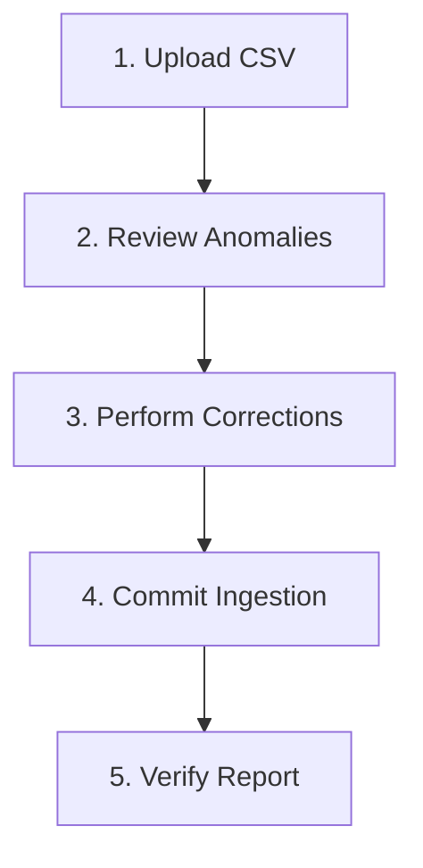

# Technical Verification & Demo Guide

This guide provides step-by-step instructions for technical reviewers to verify Splitr's features locally.

---

## 🛠️ Phase 1: Environment Sync & Startup

Follow these commands to configure the workspace and launch the local application servers.

### 1. Database Connection & Migration Sync
First, sync database structures and regenerate standard client interfaces:

```bash
# Generate client artifacts and execute DDL pushes to Neon DB
npx prisma generate
npx prisma db push
```

### 2. Startup Server
Run the local Next.js server environment:

```bash
# Start Next.js server locally
npm run dev
```

* The application will run at [http://localhost:3000](http://localhost:3000).

---

## 📂 Phase 2: Ingestion Pipeline Demo (Step-by-Step)

This walk-through demonstrates the CSV import pipeline and anomaly detection engine.



### Step 1: Access Ingestion Interface
* Navigate to the Group Dashboard and click on the **Import CSV** tab in the main sidebar.
* Upload a CSV file (e.g. containing columns: `date`, `description`, `paid_by`, `amount`, `currency`, `split_type`, `split_with`, `split_details`, `notes`).

### Step 2: Anomaly Identification
* Once parsed, the screen renders the Staging Queue.
* Look for anomalies highlighted by the engine:
  - Rows with non-standard dates marked as `INVALID_DATE` or `AMBIGUOUS_DATE`.
  - USD transactions flagged for conversion.
  - Rows with names like `Priya S` mapped to the canonical member `Priya` via the alias system.

### Step 3: Resolve Blockers
* For blocking anomalies, click **Edit Row** or select **Skip** from the action dropdown to resolve them.
* For descriptions indicating repayments (e.g. "settled up with Rohan"), click the **Convert to Settlement** helper option.

### Step 4: Commit Ingestion
* Click **Commit Ingestion** at the top right of the grid.
* The system processes split calculations in the database and updates group balances.

### Step 5: Verify Report Generation
* Review the generated report details:
  - Total records ingested.
  - Number of anomalies bypassed or resolved.
  - Base currency conversion summary.
* Verify the static copy cached at [IMPORT_REPORT.md](file:///c:/Users/manav/OneDrive/Desktop/ai-splitwise-clone/IMPORT_REPORT.md).

---

## ⚖️ Phase 3: Balance Resolution Verification

* Navigate to the **Balances** tab in the sidebar.
* Verify that the greedy debt netting engine has optimized transactions:
  - Confirm there are no circular payment paths (e.g. User A owing User B who owes User A).
  - Verify that the total debt matches the sum of all individual split differences.
