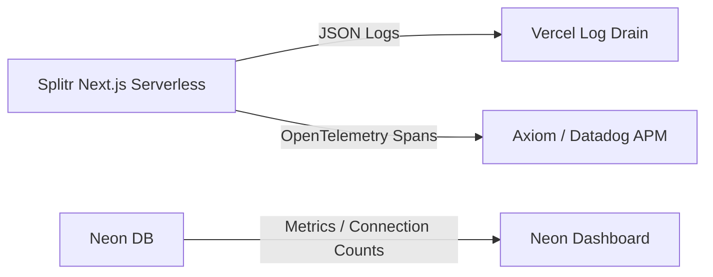

# Observability, Metrics & Telemetry

This document defines the monitoring standards, logging schemas, trace propagation rules, and alerting thresholds for Splitr.

---

## 📈 Observability Architecture

---

## 📋 1. Logging Schema & Audit Trails

To comply with high-integrity ledger standards, backend logs must output structured JSON strings to standard out (stdout). 

### Log Schema Fields
* `timestamp`: ISO-8601 string.
* `level`: `INFO` | `WARN` | `ERROR`.
* `userId`: Unique identifier of the authenticated reviewer (stripped if unauthenticated).
* `groupId`: Target collaborative scope UUID.
* `action`: Logical operation (e.g., `IMPORT_UPLOADED`, `IMPORT_COMMITTED`, `EXPENSE_CREATED`).
* `durationMs`: Total execution time of Server Action.
* `error`: Stack trace (present only on errors).

### Sensitive Data Scrubbing
* **Policy**: Under no circumstances should logs record plain text CSV records, participant email addresses, names, or individual amounts. These fields must be omitted or hashed to protect user privacy.

---

## 📊 2. Key Performance Indicators (KPIs) & Metrics

Splitr monitors the following operational metrics:

### 1. Ingestion Efficiency
* **Import Failure Rate**: Count of failed commits divided by total uploaded files. Target < 1%.
* **Staging Latency**: Time to parse and stage CSV rows. Target < 2,000ms.
* **Anomaly Count per Import**: Identifies trends in dirty data quality.

### 2. System Load
* **Database Connection Pool Exhaustion**: Track active vs. max database connections. Alert if active connections exceed 80% of Neon limit.
* **CPU and Memory Utilizations**: Serverless execution memory checks.

---

## 🔍 3. Distributed Tracing & Alerts Thresholds

### Distributed Tracing Plan
* **Context Propagation**: We plan to implement OpenTelemetry SDK. Every request triggers a unique `trace_id` propagated from the frontend HTTP headers, through Server Actions down to database query spans, allowing deep-dive analysis of slow queries.

### Alerting Rules Matrix
* **Alert: Database Timeout Rate**: Triggered if Neon DB connection timeouts exceed 5 errors in 5 minutes. (Severity: P1).
* **Alert: Ingestion Errors**: Triggered if user imports fail due to database constraint violations (e.g., unique index collision) more than 10 times in 1 hour. (Severity: P2).
* **Alert: Auth Failures**: Triggered if Clerk JWT verification returns unauthorized more than 100 times in 15 minutes (indicating a potential credentials brute-force attempt). (Severity: P1).
