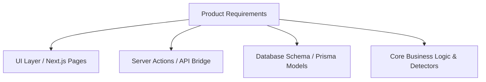

# Requirement Traceability Matrix

This document maps the core product requirements of Splitr to their exact technical implementation, detailing the corresponding user interface files, server actions, database schema models, and logic helpers.

---

## 📋 Traceability Map

### 1. CSV Staging & Ingestion Pipeline
* **Description**: Allows users to upload legacy `.csv` expense records, stages them, validates headers, parses values, and holds them in a review queue.
* **Current Implementation**:
  - **UI File**: [import/page.jsx](file:///c:/Users/manav/OneDrive/Desktop/ai-splitwise-clone/app/(main)/import/page.jsx) - CSV dropzone, grid viewer, and staging control panel.
  - **Server Action**: [imports.js](file:///c:/Users/manav/OneDrive/Desktop/ai-splitwise-clone/lib/actions/imports.js) - `upload()` function parsing and batch inserting rows using Prisma.
  - **Database Models**: 
    - `Import` - Staging batch tracker.
    - `ImportRow` - Individual raw and parsed CSV lines.
  - **Logic Helper**: `parseCsv()` and `parseRow()` inside [imports.js](file:///c:/Users/manav/OneDrive/Desktop/ai-splitwise-clone/lib/actions/imports.js) for RFC 4180 parsing.
* **Future Evolution**:
  - Offload CSV parsing to a serverless background worker (e.g., AWS Lambda or Inngest background steps) to handle massive file sizes (>10,000 lines) without blocking Next.js synchronous thread pools.

---

### 2. Anomaly Detection Engine
* **Description**: Scans imported CSV records in-memory to detect missing inputs, incorrect date formats, non-USD amounts, unmatched participants, duplicate entries, split type mismatches, and membership timing conflicts.
* **Current Implementation**:
  - **UI File**: [import/page.jsx](file:///c:/Users/manav/OneDrive/Desktop/ai-splitwise-clone/app/(main)/import/page.jsx) - Highlights anomalous rows with warning/blocking labels and details.
  - **Server Action**: `upload()` and `commit()` in [imports.js](file:///c:/Users/manav/OneDrive/Desktop/ai-splitwise-clone/lib/actions/imports.js) invoke the anomaly detectors.
  - **Database Models**: 
    - `ImportAnomaly` - Holds structural, validation, or semantic anomalies.
    - `AnomalyReview` - Tracks reviewer adjustments and decisions.
  - **Logic Helper Files**:
    - [lib/import/detectors/index.js](file:///c:/Users/manav/OneDrive/Desktop/ai-splitwise-clone/lib/import/detectors/index.js) - Orchestrator.
    - [dateFormatDetector.js](file:///c:/Users/manav/OneDrive/Desktop/ai-splitwise-clone/lib/import/detectors/dateFormatDetector.js) - Validates dates.
    - [amountDetector.js](file:///c:/Users/manav/OneDrive/Desktop/ai-splitwise-clone/lib/import/detectors/amountDetector.js) - Validates positive amount bounds.
    - [currencyDetector.js](file:///c:/Users/manav/OneDrive/Desktop/ai-splitwise-clone/lib/import/detectors/currencyDetector.js) - Identifies non-USD transactions.
    - [participantDetector.js](file:///c:/Users/manav/OneDrive/Desktop/ai-splitwise-clone/lib/import/detectors/participantDetector.js) - Checks for missing paid_by or split_with.
    - [aliasDetector.js](file:///c:/Users/manav/OneDrive/Desktop/ai-splitwise-clone/lib/import/detectors/aliasDetector.js) - Map string names to system users.
    - [duplicateDetector.js](file:///c:/Users/manav/OneDrive/Desktop/ai-splitwise-clone/lib/import/detectors/duplicateDetector.js) - Highlights exact duplicate expenses.
    - [splitTypeDetector.js](file:///c:/Users/manav/OneDrive/Desktop/ai-splitwise-clone/lib/import/detectors/splitTypeDetector.js) - Assures math consistency of splits.
    - [membershipDetector.js](file:///c:/Users/manav/OneDrive/Desktop/ai-splitwise-clone/lib/import/detectors/membershipDetector.js) - Checks active participant bounds.
* **Future Evolution**:
  - Incorporate AI-driven fuzzy matching algorithms and confidence scores to suggest auto-corrections for misspelled participant names or missing categories.

---

### 3. Split Ratios & Custom Calculations
* **Description**: Splitting expenses evenly, by specific percentages, or exact currency values across multiple group members.
* **Current Implementation**:
  - **UI File**: [expenses/new/page.jsx](file:///c:/Users/manav/OneDrive/Desktop/ai-splitwise-clone/app/(main)/expenses/new/page.jsx) - Interactively configures split allocations.
  - **Server Action**: [expenses.js](file:///c:/Users/manav/OneDrive/Desktop/ai-splitwise-clone/lib/actions/expenses.js) - `create()` and `update()` calculations.
  - **Database Models**: 
    - `Expense` - Core amount and metadata.
    - `ExpenseSplit` - Sub-rows tracking individual debtor stakes.
  - **Logic Helper**: Split validations inside [expenses.js](file:///c:/Users/manav/OneDrive/Desktop/ai-splitwise-clone/lib/actions/expenses.js) validating sum-to-100% or sum-to-total amounts.
* **Future Evolution**:
  - Support adjustment adjustments (e.g., base adjustments, custom weights) and multi-party payment shares for a single expense transaction.

---

### 4. USD to INR Currency Audit & Base Conversion
* **Description**: Records currency rates, allows multiple foreign currencies, and normalizes reports back to INR.
* **Current Implementation**:
  - **UI File**: [dashboard/page.jsx](file:///c:/Users/manav/OneDrive/Desktop/ai-splitwise-clone/app/(main)/dashboard/page.jsx) - Shows values in base currency.
  - **Server Action**: [currency.js](file:///c:/Users/manav/OneDrive/Desktop/ai-splitwise-clone/lib/actions/currency.js) - `getExchangeRate()` and `convertAmount()`.
  - **Database Models**: 
    - `CurrencyRate` - Stores historical exchange rate definitions.
  - **Logic Helper**: Auto conversion rates lookup in Neon DB, falling back to static 1 USD = 83 INR rate when dynamic API is offline.
* **Future Evolution**:
  - Integrate a scheduled cron fetching daily conversion rates from a reliable external oracle (e.g., Open Exchange Rates).

---

### 5. Pairwise Ledger Resolution & Debt Simplification
* **Description**: Aggregates all group expenses and settlements, resolving them to output the minimum set of payment paths required to clear all group balances.
* **Current Implementation**:
  - **UI File**: [balances/page.jsx](file:///c:/Users/manav/OneDrive/Desktop/ai-splitwise-clone/app/(main)/balances/page.jsx) - Interactively displays optimized debtor-to-creditor settlement directions.
  - **Server Action**: [balances.js](file:///c:/Users/manav/OneDrive/Desktop/ai-splitwise-clone/lib/actions/balances.js) - `getGroupBalances()` aggregates splits and calculates pairwise netting.
  - **Database Models**: `ExpenseSplit`, `Settlement`.
  - **Logic Helper**: Greedy ledger minimization algorithm in [balances.js](file:///c:/Users/manav/OneDrive/Desktop/ai-splitwise-clone/lib/actions/balances.js).
* **Future Evolution**:
  - Multi-group global balance netting to simplify debts across all shared groups for the same user.

---

### 6. Temporal Group Memberships & Active Timelines
* **Description**: Controls that users can only participate in splits or expenses within their active group membership window.
* **Current Implementation**:
  - **UI File**: [memberships/page.jsx](file:///c:/Users/manav/OneDrive/Desktop/ai-splitwise-clone/app/(main)/memberships/page.jsx) - Membership timeline visualizer.
  - **Server Action**: [memberships.js](file:///c:/Users/manav/OneDrive/Desktop/ai-splitwise-clone/lib/actions/memberships.js) - `addMember()`, `updateMemberJoined()`, `removeMember()`.
  - **Database Models**: `GroupMembership` - Tracking `joinedAt` and `leftAt`.
  - **Logic Helper**: Interval intersections checks inside [membershipDetector.js](file:///c:/Users/manav/OneDrive/Desktop/ai-splitwise-clone/lib/import/detectors/membershipDetector.js).
* **Future Evolution**:
  - Automatic split exclusions for expenses targeting days outside active membership intervals.

---

### 7. Background Crons, Reminders & AI Insights
* **Description**: Weekly reminder triggers, automated email generation, and monthly AI spending summaries.
* **Current Implementation**:
  - **Server-Side Jobs**: 
    - [payment-reminders.js](file:///c:/Users/manav/OneDrive/Desktop/ai-splitwise-clone/lib/inngest/payment-reminders.js) - Periodically alerts outstanding balances.
    - [spending-insights.js](file:///c:/Users/manav/OneDrive/Desktop/ai-splitwise-clone/lib/inngest/spending-insights.js) - Pulls transaction logs and calls Gemini.
  - **Logic Helpers**: Inngest workflows running under background worker configurations.
* **Future Evolution**:
  - Direct WhatsApp alerts instead of emails to improve engagement on payment settling deadlines.
