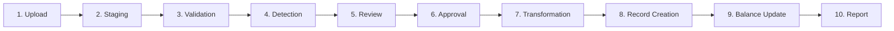

# SCOPE.md — System Boundaries, Anomaly Catalog & Data Schema

This document defines Splitr's functional domain, authorization model, anomaly detection rules, database schema, import pipeline lifecycle, and planned future capabilities.

---

## Table of Contents

- [Part 1: Domain Model & Business Context](#part-1-domain-model--business-context)
- [Part 2: Authorization Scopes](#part-2-authorization-scopes)
- [Part 3: Anomaly Catalog](#part-3-anomaly-catalog)
- [Part 4: Database Schema Overview](#part-4-database-schema-overview)
- [Part 5: CSV Import Session — Analysis Report](#part-5-csv-import-session--analysis-report)
- [Part 6: Anomaly Resolution Policy Matrix](#part-6-anomaly-resolution-policy-matrix)
- [Part 7: Import Pipeline — Stage-by-Stage Breakdown](#part-7-import-pipeline--stage-by-stage-breakdown)
- [Part 8: Data Model Reference](#part-8-data-model-reference)
- [Part 9: Roadmap & Future Scope](#part-9-roadmap--future-scope)

---

## Part 1: Domain Model & Business Context

Splitr is a multi-currency group expense ledger that addresses three specific problems: ingesting dirty CSV expense exports, normalizing and validating their contents before any record touches the production database, and resolving group balances into the minimum set of peer-to-peer transfers.

### Core Domain Concepts

**Group** — A shared financial scope with a defined membership roster and base currency. All expenses, settlements, and imports are scoped to a group.

**Member / GroupMembership** — A user's participation in a group is time-bounded by `joinedAt` and `leftAt` timestamps. Expense splits are only valid when all participants are within their active membership window on the expense date.

**Expense** — A transaction recording an outlay made by one payer on behalf of one or more participants. Supports equal, percentage, exact-amount, and share-ratio allocation modes.

**ExpenseSplit** — A normalized record linking a specific participant to their calculated share of a single expense.

**Settlement** — A direct payment from one participant to another, used to clear outstanding debt. Not split — it reduces balances directly.

**Anomaly** — A structural or logical problem detected in a staged CSV row before it is committed to the ledger (e.g. ambiguous date format, membership window violation, name misspelling).

---

## Part 2: Authorization Scopes

### Group Creator (Owner)

- Creates and configures groups, including base currency and temporal boundaries.
- Manages membership: adds/removes participants, defines alias mappings.
- Full import lifecycle control: uploads CSVs, reviews anomalies, approves and commits imports.
- Can edit or delete any expense or settlement within groups they own.

### Group Member

- Read access to the group dashboard, balances, and reports.
- Can log manual expenses or settlements.
- Can view staged imports and anomaly logs but **cannot approve or commit** CSV imports.

### System Administrator *(Planned — Not Implemented)*

- Platform-wide visibility: global audit logs, billing rate management, database maintenance.
- Not present in the current codebase. See [Part 9: Roadmap](#part-9-roadmap--future-scope).

---

## Part 3: Anomaly Catalog

The detection engine evaluates every staged row against the rules below. Anomalies are classified as **Blocking** (must be resolved before commit) or **Warning** (informational; commit is permitted).

---

### 1. `DUPLICATE_EXPENSE` — Blocking

**Condition**: Two rows share the same date, payer, and amount (within ±0.01), and their description tokens overlap by ≥ 45%.

**Resolution options**: Skip the duplicate row (recommended) or force-approve both.

---

### 2. `NEAR_DUPLICATE` — Warning

**Condition**: Two rows share the same description and amount but have dates within 24 hours of each other.

**Resolution options**: Confirm to commit both, or skip one.

---

### 3. `INVALID_DATE` — Blocking

**Condition**: The `date` field cannot be parsed by any supported date format (e.g. contains free text, an out-of-range month).

**Resolution options**: Edit the date inline in the review grid, or skip the row.

---

### 4. `AMBIGUOUS_DATE` — Blocking

**Condition**: The date string is numerically valid but format-ambiguous (e.g. `05/06/2026` could be May 6th or June 5th).

**Resolution options**: The system defaults to `dd/mm/yyyy` but blocks commit until the user explicitly confirms the parsed interpretation.

---

### 5. `MIXED_DATE_FORMAT` — Warning

**Condition**: Multiple rows in the same CSV use different date delimiters or format conventions.

**Resolution options**: Best-effort parsing is applied; the warning flags the inconsistency without blocking commit.

---

### 6. `MISSING_PAYER` — Blocking

**Condition**: The `paid_by` column is empty or blank.

**Resolution options**: Select or type a valid group member in the review UI, or skip the row.

---

### 7. `MISSING_CURRENCY` — Blocking

**Condition**: The `currency` column is absent or empty.

**Resolution options**: The engine defaults the row to the group base currency (INR) and records an audit log entry. No user action required unless the default is wrong.

---

### 8. `CURRENCY_CONVERSION_REQUIRED` — Warning

**Condition**: The `currency` value differs from the group's base currency (INR).

**Resolution options**: Automatically converts to INR using the `CurrencyRate` table (falls back to a static rate of 83 if no rate record exists). Original currency, original amount, and exchange rate are all persisted alongside the converted figure.

---

### 9. `NEGATIVE_AMOUNT` — Blocking

**Condition**: The `amount` value is less than zero (typically indicates a refund or reimbursement).

**Resolution options**: Convert to a settlement record, approve as a negative expense, or skip.

---

### 10. `ZERO_AMOUNT` — Warning

**Condition**: The `amount` field evaluates to `0.00`.

**Resolution options**: The row is flagged; the user must confirm or skip before commit.

---

### 11. `SETTLEMENT_LOGGED_AS_EXPENSE` — Blocking

**Condition**: The description or notes field matches the pattern `/(paid.*back|settlement|settle|transfer|repaid|refund)/i`.

**Resolution options**: Convert the row to a `Settlement` record (bypasses split math entirely) or skip.

---

### 12. `NON_STANDARD_SPLIT_TYPE` — Warning

**Condition**: The `split_type` field contains a recognized-but-non-standard value such as `"share"` or `"unequal"`.

**Resolution options**: Auto-normalized at commit time (`share` → weighted ratio; `unequal` → exact split). User may also skip.

---

### 13. `NAME_ALIAS` — Warning

**Condition**: A participant name in the CSV (e.g. `rohan ` with trailing space, or `priya s`) matches an entry in the group's `Alias` table, which maps it to a canonical registered user.

**Resolution options**: Auto-resolved; the canonical user record is substituted. The alias mapping is stored for reuse on future imports of the same group.

---

### 14. `MEMBERSHIP_VIOLATION` — Blocking

**Condition**: An expense date falls outside the `joinedAt`–`leftAt` window of one of its participants.

**Resolution options**: Approve as an exception (commits the row anyway), adjust the participant's membership dates on the Memberships page, or skip.

---

### 15. `GUEST_PARTICIPANT` — Warning

**Condition**: A participant name appears in the split list but is not registered as a group member.

**Resolution options**: The engine auto-creates a temporary `GroupMembership` spanning the expense date only (`joinedAt = expenseDate`, `leftAt = expenseDate + 1 day`). User may override by skipping.

---

## Part 4: Database Schema Overview

The full schema is defined in `prisma/schema.prisma`. The core entity groups are:

| Model Group | Models |
|---|---|
| Identity | `User` |
| Financial Scope | `Group`, `GroupMembership` |
| Ledger | `Expense`, `ExpenseSplit`, `Settlement` |
| Import Pipeline | `Import`, `ImportRow`, `ImportAnomaly`, `AnomalyReview` |
| Supporting Data | `Alias`, `CurrencyRate`, `ImportReport` |

Detailed field-level documentation for every model is in [Part 8](#part-8-data-model-reference).

---

## Part 5: CSV Import Session — Analysis Report

The following statistics are from the verified import session stored in Neon DB under Import ID `dbda7342-57fc-49cc-9ba1-28488ea7f2b8`.

### Session Summary

| Metric | Value |
|---|---|
| File | `goa_trip_expenses.csv` |
| Total Rows Processed | 12 |
| Rows Committed to Ledger | 11 |
| Rows Skipped | 1 (Row 3 — exact duplicate) |
| Total Anomalies Detected | 15 |
| Blocking Anomalies | 9 |
| Warning Anomalies | 6 |
| Currency Conversions Applied | 4 (USD → INR at rate 83) |
| Settlement Reclassifications | 2 |

### Anomalies by Type

| Type | Count | Affected Rows | Severity |
|---|---|---|---|
| `MEMBERSHIP_VIOLATION` | 5 | 5, 6, 7, 9, 10 | 🔴 Blocking |
| `CURRENCY_CONVERSION_REQUIRED` | 4 | 5, 6, 7, 8 | 🟡 Warning |
| `SETTLEMENT_LOGGED_AS_EXPENSE` | 2 | 4, 8 | 🔴 Blocking |
| `DUPLICATE_EXPENSE` | 1 | 3 | 🔴 Blocking |
| `NEGATIVE_AMOUNT` | 1 | 8 | 🔴 Blocking |
| `GUEST_PARTICIPANT` | 1 | 11 | 🟡 Warning |
| `NON_STANDARD_SPLIT_TYPE` | 1 | 12 | 🟡 Warning |

### Row-Level Anomaly Log

| Row | Anomaly | Severity | Details | Decision |
|---|---|---|---|---|
| 3 | `DUPLICATE_EXPENSE` | 🔴 | Matches Row 2: same date, payer, amount; description token overlap > 45% (`Dinner at Marina Bites` vs `dinner - marina bites`) | **skip** |
| 4 | `SETTLEMENT_LOGGED_AS_EXPENSE` | 🔴 | Description matched `paid back` pattern | **convert_to_settlement** → Settlement `2474e27b` |
| 5 | `MEMBERSHIP_VIOLATION` | 🔴 | Sam's `joinedAt` is April 8; expense is pre-dated | **approve** (exception) |
| 5 | `CURRENCY_CONVERSION_REQUIRED` | 🟡 | USD 450 → INR 37,350 (rate: 83) | Auto-converted |
| 6 | `CURRENCY_CONVERSION_REQUIRED` | 🟡 | USD 120 → INR 9,960 (rate: 83) | Auto-converted |
| 6 | `MEMBERSHIP_VIOLATION` | 🔴 | Sam's `joinedAt` is April 8; expense is pre-dated | **approve** (exception) |
| 7 | `MEMBERSHIP_VIOLATION` | 🔴 | Sam's `joinedAt` is April 8; expense is pre-dated | **approve** (exception) |
| 7 | `CURRENCY_CONVERSION_REQUIRED` | 🟡 | USD 180 → INR 14,940 (rate: 83) | Auto-converted |
| 8 | `NEGATIVE_AMOUNT` | 🔴 | Negative amount flagged as potential refund | **approve** |
| 8 | `SETTLEMENT_LOGGED_AS_EXPENSE` | 🔴 | Description matched repayment pattern | **convert_to_settlement** → Settlement `d1176de2` |
| 8 | `CURRENCY_CONVERSION_REQUIRED` | 🟡 | USD 300 → INR 24,900 (rate: 83) | Auto-converted |
| 9 | `MEMBERSHIP_VIOLATION` | 🔴 | Meera's `leftAt` is April 1; expense is post-dated | **approve** (exception) |
| 10 | `MEMBERSHIP_VIOLATION` | 🔴 | Sam's `joinedAt` is April 8; expense is pre-dated | **approve** (exception) |
| 11 | `GUEST_PARTICIPANT` | 🟡 | Kabir is not a registered group member | **approve** (guest auto-enrolled for expense date) |
| 12 | `NON_STANDARD_SPLIT_TYPE` | 🟡 | `split_type: "share"` normalized to weighted ratio at commit time | **approve** |

### Alias Resolutions

| Raw Name (CSV) | Resolved To | Confidence |
|---|---|---|
| `priya s` | `Priya` | 0.76 |
| `priya` | `Priya` | 0.76 |
| `rohan ` (trailing space) | `Rohan` | 0.76 |
| `Dev's friend Kabir` | `Kabir` | 0.76 |

---

## Part 6: Anomaly Resolution Policy Matrix

Detailed detection logic, confidence scores, and outcomes for each anomaly type.

---

### `DUPLICATE_EXPENSE`
- **Detector**: `duplicateDetector.js`
- **Logic**: O(n²) pairwise scan. Blocking when two rows share the same date and payer, amount delta < 0.01, and description token overlap ≥ 0.45. Confidence: **0.92**.
- **Default action**: `skip` — the later row is suggested for discard.
- **User choices**: Skip (discard) or Force Approve (keep both).
- **Outcome**: Skipped rows are never written to `Expense`.

### `NEAR_DUPLICATE`
- **Detector**: `duplicateDetector.js`
- **Logic**: Same-date rows where description similarity ≥ 0.50 and amount difference ≤ 100. Confidence: **0.72**.
- **Default action**: `correct` — flagged for manual review.
- **User choices**: Approve both or skip one.
- **Outcome**: Both rows committed unless one is skipped.

### `CURRENCY_CONVERSION_REQUIRED`
- **Detector**: `currencyDetector.js`
- **Logic**: `row.parsed.currency !== "INR"`. Confidence: **0.99**.
- **Default action**: `convert` — converts using `CurrencyRate` table; falls back to static rate of 83.
- **User choices**: Accept conversion or skip.
- **Outcome**: `Expense` stores `originalAmount`, `originalCurrency`, `exchangeRate`, and `convertedAmount`. Ledger uses the INR figure.

### `SETTLEMENT_LOGGED_AS_EXPENSE`
- **Detector**: `participantDetector.js`
- **Logic**: Description/notes match `/(paid.*back|settlement|settle|transfer|repaid|refund)/i`. Confidence: **0.86**.
- **Default action**: `convert` — prompts reclassification as a `Settlement` record.
- **User choices**: Convert to Settlement or Skip.
- **Outcome**: Row is written to `Settlement`; no split math is performed.

### `MEMBERSHIP_VIOLATION`
- **Detector**: `membershipDetector.js`
- **Logic**: Hardcoded membership intervals checked at import time. Meera: Feb 1 – Apr 1, 2026. Sam: Apr 8, 2026 onwards. Dev: Feb 8 – Mar 15, 2026. Any expense date outside a participant's window is blocking. Confidence: **0.88**.
- **Default action**: `correct` — blocked pending resolution.
- **User choices**: Approve as exception, adjust membership dates, or Skip.
- **Outcome**: Approved exceptions are committed; membership windows are created or extended as needed.

### `GUEST_PARTICIPANT`
- **Detector**: `membershipDetector.js`
- **Logic**: Participant name (Kabir) is not found in `GroupMembership`. Confidence: **0.90**.
- **Default action**: `approve` — temporary one-day `GroupMembership` auto-created.
- **User choices**: Approve (keep) or Skip.
- **Outcome**: `GroupMembership` written with `joinedAt = expenseDate`, `leftAt = expenseDate + 1 day`.

### `NEGATIVE_AMOUNT`
- **Detector**: `amountDetector.js`
- **Logic**: `row.parsed.amount < 0`. Confidence: **0.93**.
- **Default action**: `correct` — blocked pending user decision.
- **User choices**: Approve as negative expense, convert to Settlement, or Skip.
- **Outcome**: If approved, `Expense` is committed with the negative amount preserved.

### `NON_STANDARD_SPLIT_TYPE`
- **Detector**: `splitTypeDetector.js`
- **Logic**: `splitType` is `"share"` or `"unequal"` — recognized but non-standard. Confidence: **0.90**.
- **Default action**: `approve` — auto-normalized at commit (`share` → weighted ratio; `unequal` → exact split).
- **User choices**: Accept normalization or Skip.
- **Outcome**: `ExpenseSplit` records written using the transformed split type.

### `NAME_ALIAS`
- **Detector**: `aliasDetector.js`
- **Logic**: Raw name compared against the group's canonical alias map (`priya s` → `Priya`, `rohan ` → `Rohan`, `Dev's friend Kabir` → `Kabir`). Triggered when raw name ≠ canonical resolution. Confidence: **0.76**.
- **Default action**: `approve` — alias resolved automatically.
- **User choices**: Accept or Skip.
- **Outcome**: Canonical `User` record referenced on `Expense` and `ExpenseSplit`; alias written to `Alias` table for reuse.

### `INVALID_DATE` / `AMBIGUOUS_DATE` / `MIXED_DATE_FORMAT`
- **Detector**: `dateFormatDetector.js`
- **Logic**:
  - `INVALID_DATE`: `new Date(raw)` fails → blocking, confidence **0.98**.
  - `AMBIGUOUS_DATE`: Parser sets `ambiguousDate = true` (e.g. `05/06/2026`) → blocking, confidence **0.90**.
  - `MIXED_DATE_FORMAT`: More than one unique date format found across the file → warning on first occurrence, confidence **0.80**.
- **Default action**: `correct` (blocking) / `approve` (warning).
- **User choices**: Edit date in-grid or Skip (blocking); Approve (warning).
- **Outcome**: Corrected date written to `ImportRow.parsed` and used as `Expense.date`.

---

## Part 7: Import Pipeline — Stage-by-Stage Breakdown

The import pipeline moves a CSV file through ten discrete stages. Primary implementation is in `lib/actions/imports.js`.

---

### Stage 1 — Upload

**Entry point**: `upload({ groupId, csvText, fileName })`

The raw CSV string arrives from the client's `FileReader` API. No file is written to disk; all processing is in-memory. The text is forwarded directly to the parser.

---

### Stage 2 — Staging

**Functions**: `parseCsv(text)` and `parseRow(row.raw)` inside `upload()`

A custom RFC 4180-compliant parser splits the text into rows, lowercases and underscores-separates all headers, and produces `{ rowNumber, raw, parsed }` objects. Missing required columns throw immediately. An `Import` record is created with `status: "uploaded"`, and all rows are batch-inserted via `importRow.createManyAndReturn` in a single transaction (30-second timeout). Maximum: **500 rows per upload**.

---

### Stage 3 — Validation

Immediately after staging, the `detectors.detectRowAnomalies(stagedRows)` orchestrator runs all nine detector modules against the in-memory staged row array. No additional database reads occur during this phase.

---

### Stage 4 — Detection

**Detectors run in order**:

1. `detectDateAnomalies` — date parsing and format consistency
2. `detectAmountAnomalies` — null, negative, and zero amounts
3. `detectCurrencyAnomalies` — missing or non-INR currencies
4. `detectParticipantAnomalies` — empty split lists; settlement text patterns
5. `detectAliasAnomalies` — name normalization mismatches
6. `detectMembershipAnomalies` — temporal window violations and guest participants
7. `detectDuplicateAnomalies` — exact and near-duplicate rows
8. `detectSplitTypeAnomalies` — non-standard split keywords

All detected anomalies are batch-inserted via `importAnomaly.createMany`. The `Import` status is updated to `"needs_review"` if anomalies exist, or `"ready"` if none are found.

---

### Stage 5 — Review

**Entry point**: `reviewAnomaly({ anomalyId, decision, correctedValue, note })`

The reviewer selects `"approve"`, `"skip"`, or `"convert_to_settlement"` per anomaly. Each decision writes an `AnomalyReview` record and updates the anomaly's status from `"open"` to `"reviewed"`. The parent `Import`'s `blockingCount` is decremented. **A commit cannot proceed while any blocking anomaly remains `"open"`**.

---

### Stage 6 — Approval

**Entry point**: `approve({ importId })`

Queries `ImportAnomaly` for any remaining open blocking anomalies. If none remain, `Import.status` is updated to `"approved"` and `approvedAt` is set. If any are still open, throws: `"Resolve N blocking anomalies before approval"`.

---

### Stage 7 — Transformation

**Entry point**: `commit({ importId })` (60-second transaction timeout)

Each approved `ImportRow` is processed: currency conversions are applied, alias names are resolved to canonical `User` IDs, non-standard split types are normalized, and rows flagged for settlement conversion are routed separately from expense rows.

---

### Stage 8 — Record Creation

For each non-settlement row, an `Expense` record is created with full currency audit fields (`originalAmount`, `originalCurrency`, `exchangeRate`, `convertedAmount`). `ExpenseSplit` records are bulk-inserted per participant. Settlement-classified rows write to the `Settlement` table instead. All created records carry `sourceImportId` and `sourceImportRowId` foreign keys linking them back to their origin CSV line.

---

### Stage 9 — Balance Update

Balances are **not eagerly recalculated** on commit. The `balances.js` action performs on-demand aggregation of all `ExpenseSplit` and `Settlement` records when the Balances page is loaded. This avoids a separate cache invalidation mechanism and guarantees the view is always current.

---

### Stage 10 — Report Generation

Immediately after the commit transaction closes, `generateReport({ importId })` aggregates row counts, anomaly type breakdown, currency conversions, and settlement reclassifications into a summary JSON object. This is persisted to a new `ImportReport` record and rendered in the import detail screen. A static export is available at `IMPORT_REPORT.md`.

---

## Part 8: Data Model Reference

Source of truth: `prisma/schema.prisma`. Each model is documented below with its purpose, key fields, relationships, indexes, and lifecycle.

---

### `User`

**Purpose**: Core profile record, synchronized from Clerk JWT identity tokens on first sign-in.

**Key fields**: `id` (UUIDv4), `tokenIdentifier` (Clerk `sub` claim, unique), `name`, `email` (unique, nullable), `imageUrl`.

**Owns**: `Expense` (as payer and creator), `ExpenseSplit`, `Settlement` (as payer, receiver, and creator), `GroupMembership`, `Import`, `AnomalyReview`, `Alias`, `CurrencyRate`, `ImportReport`.

**Index**: `tokenIdentifier` (unique) — used on every authenticated request.

**Lifecycle**: Auto-created on first login → updated on profile changes → soft-anonymized on account deletion.

---

### `Group`

**Purpose**: Financial isolation boundary for all expenses, memberships, and imports.

**Key fields**: `id`, `name`, `description`, `createdByUserId`, `members` (JSONB — embedded `{userId, role, joinedAt}` list for UI compatibility alongside normalized `GroupMembership` rows).

**Owns**: `GroupMembership`, `Expense`, `Settlement`, `Import`, `ImportRow`, `Alias`, `ImportReport`.

**Lifecycle**: Created → members added → expenses accrued → imports committed → optionally archived.

---

### `Expense`

**Purpose**: A single financial outlay by a payer, allocated across one or more participants.

**Key fields**: `id`, `description`, `amount` (INR ledger value), `originalAmount`, `originalCurrency`, `exchangeRate`, `convertedAmount`, `category`, `date`, `paidByUserId`, `splitType`, `splits` (JSONB, legacy), `groupId`, `sourceImportId`, `sourceImportRowId`.

**Indexes**: `[groupId]`, `[paidByUserId, groupId]`, `[date]`, `[groupId, date]`, `[sourceImportRowId]`.

**Lifecycle**: Created manually or via CSV commit → used in balance aggregation → linked to settlements as debts are cleared.

---

### `ExpenseSplit`

**Purpose**: Normalized record capturing each participant's calculated share of a specific expense.

**Key fields**: `id`, `expenseId`, `userId`, `amount`, `splitType`, `percentage`, `shares`, `paid` (boolean), `sourceImportRowId`.

**Indexes**: `[expenseId]`, `[userId]`, `[userId, expenseId]`.

**Cascade**: Deleted when parent `Expense` is deleted.

**Lifecycle**: Created atomically with its parent `Expense` → read during balance aggregation → `paid` set to `true` when settled.

---

### `Settlement`

**Purpose**: A direct payment between two participants clearing outstanding ledger debt.

**Key fields**: `id`, `amount`, `originalAmount`, `originalCurrency`, `exchangeRate`, `convertedAmount`, `note`, `date`, `paidByUserId`, `receivedByUserId`, `groupId`, `relatedExpenseIds` (String array), `sourceImportId`, `sourceImportRowId`.

**Indexes**: `[groupId]`, `[paidByUserId, groupId]`, `[receivedByUserId, groupId]`, `[date]`, `[groupId, date]`, `[sourceImportRowId]`.

**Lifecycle**: Created manually or auto-created during commit when a CSV row is reclassified → read during pairwise balance netting.

---

### `GroupMembership`

**Purpose**: Time-bounded participation record tracking when a user is active in a group.

**Key fields**: `id`, `groupId`, `userId`, `role`, `joinedAt` (DateTime), `leftAt` (DateTime, nullable), `source` (`"manual"` or `"import"`), `sourceImportRowId`, `createdByUserId`.

**Indexes**: `[groupId]`, `[userId]`, `[groupId, userId]`, `[groupId, joinedAt]`.

**Lifecycle**: Created with `joinedAt` → `leftAt` set on departure → queried during import anomaly detection for temporal validation.

---

### `Import`

**Purpose**: Session record tracking a single CSV upload through staging, review, approval, and commit.

**Key fields**: `id`, `groupId`, `uploadedById`, `fileName`, `status` (`uploaded → needs_review → approved → committed`), `rowCount`, `importedCount`, `skippedCount`, `anomalyCount`, `blockingCount`, `createdAt`, `approvedAt`, `committedAt`.

**Indexes**: `[uploadedById]`, `[groupId]`, `[status]`.

**Lifecycle**: Created on upload → status transitions gated by business rules → `committed` is the terminal state.

---

### `ImportRow`

**Purpose**: Stores each CSV line through the staging pipeline, preserving both raw and parsed representations.

**Key fields**: `id`, `importId`, `groupId`, `rowNumber`, `raw` (JSONB — original key-value map), `parsed` (JSONB — normalized values), `normalized` (JSONB, nullable), `status`, `createdExpenseId`, `createdSettlementId`.

**Indexes**: `[importId]`, `[importId, rowNumber]`, `[importId, status]`.

**Lifecycle**: Created with parent `Import` → anomalies detected → reviewer actions applied → committed (linked to `Expense` or `Settlement`) or skipped.

---

### `ImportAnomaly`

**Purpose**: A single validation problem detected in a staged CSV row.

**Key fields**: `id`, `importId`, `rowId`, `rowNumber`, `type`, `severity` (`blocking / warning / info`), `message`, `suggestedAction`, `confidenceScore`, `status` (`open → reviewed`), `metadata` (JSONB).

**Indexes**: `[importId]`, `[rowId]`, `[importId, status]`, `[importId, type]`.

**Cascade**: Deleted when parent `Import` or `ImportRow` is deleted.

**Lifecycle**: Created by the detection engine as `open` → reviewer submits decision → updated to `reviewed` → parent `Import.blockingCount` decremented.

---

### `AnomalyReview`

**Purpose**: Records a reviewer's explicit decision on a specific anomaly, including any corrected value.

**Key fields**: `id`, `importId`, `anomalyId`, `rowId`, `reviewerId`, `decision` (`approve / skip / convert_to_settlement`), `correctedValue` (JSONB, nullable), `note`, `reviewedAt`.

**Indexes**: `[importId]`, `[anomalyId]`, `[reviewerId]`.

**Lifecycle**: Created when a decision is submitted → read during commit to determine each row's fate. One review per anomaly (upserted on re-review).

---

### `Alias`

**Purpose**: Maps a raw CSV name string to a canonical registered user, enabling fuzzy participant resolution across imports.

**Key fields**: `id`, `groupId`, `rawName`, `normalizedName`, `userId`, `confidence`, `source`, `sourceImportId`, `createdByUserId`.

**Indexes**: `[groupId, rawName]`, `[userId]`.

**Lifecycle**: Created automatically by the alias detector or manually by a Group Owner → reused on all subsequent imports of the same group.

---

### `CurrencyRate`

**Purpose**: Historical exchange rate definitions used to convert foreign-currency expenses to the group base currency (INR).

**Key fields**: `id`, `fromCurrency`, `toCurrency`, `rate`, `effectiveDate`, `source`, `createdByUserId`.

**Indexes**: `[fromCurrency, toCurrency, effectiveDate]`, `[effectiveDate]`.

**Note**: The `goa_trip_expenses.csv` session used a static fallback rate of 83 (no matching `CurrencyRate` row existed in the database at import time).

**Lifecycle**: Seeded manually or via a future scheduled job → referenced immutably on `Expense` records.

---

### `ImportReport`

**Purpose**: Persisted audit summary of a completed CSV import session.

**Key fields**: `id`, `importId`, `groupId`, `generatedById`, `summaryJson` (JSONB — row counts, anomaly breakdown, currency conversions, settlement reclassifications), `generatedAt`.

**Indexes**: `[importId]`, `[groupId]`.

**Lifecycle**: Created automatically by `generateReport()` immediately after a successful commit → read-only thereafter.

---

## Part 9: Roadmap & Future Scope

The following capabilities are planned but are **not present in the current codebase**:

| Feature | Description |
|---|---|
| **System Administrator Role** | A platform-level role for global audit trail access, billing rate management, and database maintenance scripts. Currently, only Group Creator and Group Member scopes are implemented. |
| **Live Exchange Rate Fetching** | A scheduled Inngest cron job to pull daily rates from an external provider (e.g. Open Exchange Rates) and seed the `CurrencyRate` table. Currently uses a static fallback rate of 83 USD/INR. |
| **Large File Streaming** | For CSV files exceeding 500 rows, offload parsing and staging to an asynchronous Inngest background step rather than a synchronous Server Action. |
| **Inline Grid Editing** | A frontend component allowing reviewers to correct field values (dates, amounts, names) directly in the staging grid, rather than exclusively through the review modal. |
| **Cross-Group Debt Netting** | Extend the pairwise resolution algorithm to simplify debts across multiple groups that share an overlapping participant set. |
