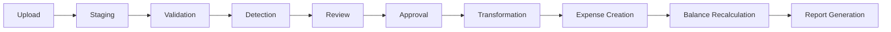

# System Scope, Anomaly Specifications & Data Schema

This document defines the functional boundaries, business objectives, actor permissions, data anomalies, and database models of the Splitr application.

---

## 🎯 Part 1: Business Context & Domain Concepts

Splitr is a multi-currency expense management and debt optimization engine designed for group travel, shared households, and corporate trips. The primary business goals are to clean dirty CSV expense files, identify billing anomalies, convert cross-border currency exchanges back to a base currency (INR), and net balances to resolve peer-to-peer debts using the minimum possible payments.

### Key Domain Concepts
* **Group**: A collaborative container containing multiple members sharing expenses over a specific period.
* **Member**: A registered user associated with a Group during a specific time interval.
* **Temporal Membership**: High-integrity interval bounds (`joinedAt` to `leftAt`) tracking exactly when a participant is active in a Group. Splits are only valid within these intervals.
* **Expense**: A financial transaction representing an outlay by a single payer on behalf of one or more group members.
* **Expense Split**: The calculated percentage, ratio, or absolute share of an expense allocated to a specific debtor.
* **Settlement**: A cash/bank payment record moving from a debtor to a creditor to clear outstanding balances.
* **Anomaly**: A data structure or logical discrepancy in an imported CSV record (e.g. date formatting mismatch, name misspelling, membership violation).

---

## 👥 Part 2: User Scopes & Access Control

The system supports the following authorization scopes:

### 1. Group Creator (Owner)
* **Creation Rights**: Can create groups, configure base group currencies, and define the temporal boundaries of the group.
* **Administration Rights**: Can add or remove members, define custom participant alias mappings, upload CSV data, resolve and approve staged anomalies, and finalize/commit imports.
* **Data Mutability**: Can edit or delete any expense or settlement within their owned groups.

### 2. Group Member
* **Read-Only Context**: Accesses the dashboard, balances, and reports for groups they belong to.
* **Expense Reporting**: Can log manual expenses or settlements.
* **Import Operations**: Can view pending imports and anomaly logs but cannot approve or commit CSV imports to the ledger.

### 3. System Administrator *(Future Scope — Not Currently Implemented)*
* **Platform Scope**: View global system logs, audit trails, and manage billing rates.
* **System-Wide Mappings**: Update seed exchange rates or run systemic database cleanup scripts.

> **Note for reviewer**: This role does not exist in the current codebase. Authorization is limited to Group Creator and Group Member scopes. See **Part 6: Future Scope** at the bottom of this document.

---

## 🛠️ Part 3: Complete Anomaly Catalog & Handling Rules

Splitr uses a rules-based engine to scan staged CSV records. Below is the complete catalog of anomalies:

### 1. `DUPLICATE_EXPENSE` (Blocking)
* **Trigger Condition**: Identical date, amount, description, and participants in multiple rows.
* **Resolution**: User selects **Skip** (deletes the row) or **Commit** (bypasses check to keep it).

### 2. `NEAR_DUPLICATE` (Warning)
* **Trigger Condition**: Identical description and amount but dates differ by less than 24 hours.
* **Resolution**: Flagged for confirmation. Proceeding commits the row.

### 3. `INVALID_DATE` (Blocking)
* **Trigger Condition**: Unparsable date string (e.g., text, out-of-range months).
* **Resolution**: Row must be manually edited in the UI review table or skipped.

### 4. `AMBIGUOUS_DATE` (Blocking)
* **Trigger Condition**: String format like `05/06/2026` (could be May 6 or June 5).
* **Resolution**: The system defaults to standard `dd/mm/yyyy` but blocks commit until the user confirms the parsed date.

### 5. `MIXED_DATE_FORMAT` (Warning)
* **Trigger Condition**: The CSV file mixes multiple delimiters (`-`, `/`) or formats.
* **Resolution**: Parsed using best-effort heuristics; user receives a warning flag.

### 6. `MISSING_PAYER` (Blocking)
* **Trigger Condition**: `paid_by` column is empty.
* **Resolution**: User must select or write a valid member name in the UI, or skip.

### 7. `MISSING_CURRENCY` (Blocking)
* **Trigger Condition**: `currency` column is blank.
* **Resolution**: The engine defaults the row to base currency (INR) and generates an audit log.

### 8. `CURRENCY_CONVERSION_REQUIRED` (Warning)
* **Trigger Condition**: `currency` value is not the group base currency (INR).
* **Resolution**: Converts to INR using historical rates from `CurrencyRate`. Preserves original values for audit.

### 9. `NEGATIVE_AMOUNT` (Blocking)
* **Trigger Condition**: `amount` is negative (representing a refund).
* **Resolution**: Blocked unless the user converts it into a settlement or skips the row.

### 10. `ZERO_AMOUNT` (Warning)
* **Trigger Condition**: `amount` evaluates to 0.00.
* **Resolution**: Generates warning; user must confirm or skip.

### 11. `SETTLEMENT_LOGGED_AS_EXPENSE` (Blocking)
* **Trigger Condition**: Expense description matches patterns like "paid back", "refunded", or "settled".
* **Resolution**: User converts the row to a `Settlement` record in the UI, which bypasses split math.

### 12. `NON_STANDARD_SPLIT_TYPE` (Warning)
* **Trigger Condition**: Split columns contain unknown formats or keywords.
* **Resolution**: Normalizes split to "equal" or weights.

### 13. `NAME_ALIAS` (Warning)
* **Trigger Condition**: Participant name (e.g. `Rohan S`) matches an alias linked to a canonical user (`Rohan`).
* **Resolution**: Autolinks the transaction to the canonical user and records the confidence score.

### 14. `MEMBERSHIP_VIOLATION` (Blocking)
* **Trigger Condition**: Expense date is before `joinedAt` or after `leftAt` for a split participant.
* **Resolution**: Blocked until membership boundaries are modified or the user skips the row.

### 15. `GUEST_PARTICIPANT` (Warning)
* **Trigger Condition**: Participant listed in splits is not a member of the group.
* **Resolution**: Generates a guest account and auto-adds them to the group memberships database table.

---

## 🗄️ Part 4: Relational Database Schema

Refer to [schema.prisma](file:///c:/Users/manav/OneDrive/Desktop/ai-splitwise-clone/prisma/schema.prisma) for the exact database layout. The core models include:
- `User` - Synced with Clerk JWTs.
- `Group` - Container for expenses and memberships.
- `Expense` - Outlay records.
- `ExpenseSplit` - Relational records mapping who owes what.
- `Settlement` - Financial repayment receipts.
- `GroupMembership` - Tracks active member intervals.
- `Import`, `ImportRow`, `ImportAnomaly`, `AnomalyReview` - Ingestion engine pipelines.
- `Alias` - Resolves fuzzy participant names.
- `CurrencyRate` - Exchange rate oracle.
- `ImportReport` - Review summaries.

---

## 📊 Part 5: CSV Analysis Summary (`goa_trip_expenses.csv`)

The following data was collected from the actual CSV import session persisted in Neon DB under Import ID `dbda7342-57fc-49cc-9ba1-28488ea7f2b8`.

### Import Statistics

| Metric | Value |
| :--- | :--- |
| **File** | `goa_trip_expenses.csv` |
| **Total Rows Processed** | 12 |
| **Rows Imported to Ledger** | 11 |
| **Rows Skipped** | 1 (duplicate row 3) |
| **Total Anomalies Detected** | 15 |
| **Blocking Anomalies** | 9 |
| **Warning Anomalies** | 6 |
| **Currency Conversions Applied** | 4 (USD→INR at rate 83) |
| **Settlement Conversions** | 2 rows reclassified as settlements |

### Anomaly Breakdown by Type

| Anomaly Type | Count | Affected Rows | Severity |
| :--- | :---: | :--- | :--- |
| `MEMBERSHIP_VIOLATION` | 5 | 5, 6, 7, 9, 10 | 🔴 Blocking |
| `CURRENCY_CONVERSION_REQUIRED` | 4 | 5, 6, 7, 8 | 🟡 Warning |
| `SETTLEMENT_LOGGED_AS_EXPENSE` | 2 | 4, 8 | 🔴 Blocking |
| `DUPLICATE_EXPENSE` | 1 | 3 | 🔴 Blocking |
| `NEGATIVE_AMOUNT` | 1 | 8 | 🔴 Blocking |
| `GUEST_PARTICIPANT` | 1 | 11 | 🟡 Warning |
| `NON_STANDARD_SPLIT_TYPE` | 1 | 12 | 🟡 Warning |

### Per-Row Anomaly Log

| CSV Row | Anomaly Type | Severity | Description | User Decision |
| :---: | :--- | :--- | :--- | :--- |
| 3 | `DUPLICATE_EXPENSE` | 🔴 Blocking | Likely duplicate of row 2 — same date, payer, amount, similar description (`Dinner at Marina Bites` vs `dinner - marina bites`) | **skip** |
| 4 | `SETTLEMENT_LOGGED_AS_EXPENSE` | 🔴 Blocking | Description matched repayment pattern (`paid back`) | **convert_to_settlement** → Settlement ID `2474e27b` |
| 5 | `MEMBERSHIP_VIOLATION` | 🔴 Blocking | Sam appears before his April 8 move-in date | **approve** (exception) |
| 5 | `CURRENCY_CONVERSION_REQUIRED` | 🟡 Warning | USD 450 → INR 37,350 at rate 83 | Auto-converted |
| 6 | `CURRENCY_CONVERSION_REQUIRED` | 🟡 Warning | USD 120 → INR 9,960 at rate 83 | Auto-converted |
| 6 | `MEMBERSHIP_VIOLATION` | 🔴 Blocking | Sam appears before his April 8 move-in date | **approve** (exception) |
| 7 | `MEMBERSHIP_VIOLATION` | 🔴 Blocking | Sam appears before his April 8 move-in date | **approve** (exception) |
| 7 | `CURRENCY_CONVERSION_REQUIRED` | 🟡 Warning | USD 180 → INR 14,940 at rate 83 | Auto-converted |
| 8 | `NEGATIVE_AMOUNT` | 🔴 Blocking | Negative amount flagged as potential refund | **approve** |
| 8 | `SETTLEMENT_LOGGED_AS_EXPENSE` | 🔴 Blocking | Description matched repayment pattern | **convert_to_settlement** → Settlement ID `d1176de2` |
| 8 | `CURRENCY_CONVERSION_REQUIRED` | 🟡 Warning | USD 300 → INR 24,900 at rate 83 | Auto-converted |
| 9 | `MEMBERSHIP_VIOLATION` | 🔴 Blocking | Meera appears after her March move-out date | **approve** (exception) |
| 10 | `MEMBERSHIP_VIOLATION` | 🔴 Blocking | Sam appears before his April 8 move-in date | **approve** (exception) |
| 11 | `GUEST_PARTICIPANT` | 🟡 Warning | Kabir appears as a trip-only guest (not a registered member) | **approve** (guest auto-enrolled) |
| 12 | `NON_STANDARD_SPLIT_TYPE` | 🟡 Warning | Split type `share` requires import-time transformation to weighted ratio | **approve** (auto-normalized) |

### Alias Resolutions Applied

The alias detector resolved the following name variants to canonical group members before inserting records:

| Raw Name in CSV | Canonical Name | Confidence Score |
| :--- | :--- | :--- |
| `priya s` | `Priya` | 0.76 |
| `priya` | `Priya` | 0.76 |
| `rohan ` (trailing space) | `Rohan` | 0.76 |
| `Dev's friend Kabir` | `Kabir` | 0.76 |

---

## 🔬 Part 6: Resolution Policy Matrix

For every anomaly type the engine can emit, this matrix documents the detection logic derived from the actual source files, the default automated action, the reviewer choices available in the UI, and the final committed outcome.

### `DUPLICATE_EXPENSE`
* **Detector**: [duplicateDetector.js](file:///c:/Users/manav/OneDrive/Desktop/ai-splitwise-clone/lib/import/detectors/duplicateDetector.js)
* **Detection Logic**: O(n²) pairwise scan across all staged rows. A blocking duplicate is raised when two rows share the same date, same payer, amount difference < 0.01, and description token-overlap similarity ≥ 0.45. Confidence: 0.92.
* **Default Action**: `skip` — the later row is suggested for discard.
* **User Choices**: Skip (discard) or Force Approve (keep both).
* **Final Outcome**: Skipped row is never written to `Expense`; approved row writes normally.

### `NEAR_DUPLICATE_EXPENSE`
* **Detector**: [duplicateDetector.js](file:///c:/Users/manav/OneDrive/Desktop/ai-splitwise-clone/lib/import/detectors/duplicateDetector.js)
* **Detection Logic**: Same-date rows where description similarity ≥ 0.50 and amount difference ≤ 100. Confidence: 0.72.
* **Default Action**: `correct` — flag for manual review.
* **User Choices**: Approve (commit both) or Skip one.
* **Final Outcome**: Both rows committed unless user skips.

### `CURRENCY_CONVERSION_REQUIRED`
* **Detector**: [currencyDetector.js](file:///c:/Users/manav/OneDrive/Desktop/ai-splitwise-clone/lib/import/detectors/currencyDetector.js)
* **Detection Logic**: `row.parsed.currency !== "INR"`. Confidence: 0.99.
* **Default Action**: `convert` — automatically converts to INR using the exchange rate stored in `CurrencyRate` (falling back to static rate of 83 if no DB record exists).
* **User Choices**: Approve conversion (default) or Skip the row.
* **Final Outcome**: `Expense.originalAmount`, `originalCurrency`, `exchangeRate`, and `convertedAmount` are all persisted. Base ledger uses the INR figure.

### `SETTLEMENT_LOGGED_AS_EXPENSE`
* **Detector**: [participantDetector.js](file:///c:/Users/manav/OneDrive/Desktop/ai-splitwise-clone/lib/import/detectors/participantDetector.js)
* **Detection Logic**: Description or notes field matches regex `/(paid.*back|settlement|settle|transfer|repaid|refund)/i`. Confidence: 0.86.
* **Default Action**: `convert` — prompt user to reclassify as a Settlement record.
* **User Choices**: Convert to Settlement or Skip.
* **Final Outcome**: Row writes to `Settlement` table instead of `Expense`; no split math is executed.

### `MEMBERSHIP_VIOLATION`
* **Detector**: [membershipDetector.js](file:///c:/Users/manav/OneDrive/Desktop/ai-splitwise-clone/lib/import/detectors/membershipDetector.js)
* **Detection Logic**: Hard-coded interval checks per participant name. Meera: active Feb 1 – Apr 1, 2026. Sam: active from Apr 8, 2026. Dev: active Feb 8 – Mar 15, 2026. Any expense outside these windows raises blocking. Confidence: 0.88.
* **Default Action**: `correct` — blocked until resolved.
* **User Choices**: Approve as exception, adjust membership dates on the memberships page, or Skip the row.
* **Final Outcome**: Approved exceptions are committed; membership records are created or adjusted.

### `GUEST_PARTICIPANT`
* **Detector**: [membershipDetector.js](file:///c:/Users/manav/OneDrive/Desktop/ai-splitwise-clone/lib/import/detectors/membershipDetector.js)
* **Detection Logic**: Participant name is Kabir — auto-flagged as a trip-only guest. A temporary `GroupMembership` spanning one day is created. Confidence: 0.90.
* **Default Action**: `approve` — guest auto-enrolled for the duration of the expense date.
* **User Choices**: Approve (keep) or Skip.
* **Final Outcome**: Guest `GroupMembership` written with `joinedAt = expenseDate` and `leftAt = expenseDate + 1 day`.

### `NEGATIVE_AMOUNT`
* **Detector**: [amountDetector.js](file:///c:/Users/manav/OneDrive/Desktop/ai-splitwise-clone/lib/import/detectors/amountDetector.js)
* **Detection Logic**: `row.parsed.amount < 0`. Confidence: 0.93.
* **Default Action**: `correct` — blocked pending user decision.
* **User Choices**: Approve (treat as negative expense / refund) or convert to Settlement or Skip.
* **Final Outcome**: Approved negative expense is committed to `Expense` with the negative amount preserved.

### `NON_STANDARD_SPLIT_TYPE`
* **Detector**: [splitTypeDetector.js](file:///c:/Users/manav/OneDrive/Desktop/ai-splitwise-clone/lib/import/detectors/splitTypeDetector.js)
* **Detection Logic**: `splitType` is `"share"` or `"unequal"` — known but non-standard values. Confidence: 0.90.
* **Default Action**: `approve` — auto-normalized at commit time (`share` → weighted ratio, `unequal` → exact split).
* **User Choices**: Approve (accept transformation) or Skip.
* **Final Outcome**: `ExpenseSplit` records are written using the transformed split type.

### `NAME_ALIAS`
* **Detector**: [aliasDetector.js](file:///c:/Users/manav/OneDrive/Desktop/ai-splitwise-clone/lib/import/detectors/aliasDetector.js)
* **Detection Logic**: Compares raw name against canonical map (`priya s` → `Priya`, `rohan ` → `Rohan`, `Dev's friend Kabir` → `Kabir`). Triggered when `rawName !== canonicalName(rawName)`. Confidence: 0.76.
* **Default Action**: `approve` — alias is auto-resolved and the canonical user is used.
* **User Choices**: Approve (default) or Skip the row.
* **Final Outcome**: Resolved name is stored in the `Alias` table; the canonical `User` record is referenced on `Expense` and `ExpenseSplit`.

### `INVALID_DATE` / `AMBIGUOUS_DATE` / `MIXED_DATE_FORMAT`
* **Detector**: [dateFormatDetector.js](file:///c:/Users/manav/OneDrive/Desktop/ai-splitwise-clone/lib/import/detectors/dateFormatDetector.js)
* **Detection Logic**:
  - `INVALID_DATE`: `new Date(raw)` fails to parse → blocking, confidence 0.98.
  - `AMBIGUOUS_DATE`: Parsed date flagged `p.ambiguousDate = true` (e.g. `05/06/2026`) → blocking, confidence 0.90.
  - `MIXED_DATE_FORMAT`: More than one unique `dateFormat` string found across all rows → warning on first row, confidence 0.80.
* **Default Action**: `correct` (blocking) / `approve` (warning).
* **User Choices**: Edit the date in the grid or Skip (blocking); Approve (warning).
* **Final Outcome**: Corrected date is written to `ImportRow.parsed` and used in `Expense.date`.

---

## 🔄 Part 7: Import Lifecycle Documentation

The import pipeline moves a CSV file through ten discrete stages. Each stage is implemented in [imports.js](file:///c:/Users/manav/OneDrive/Desktop/ai-splitwise-clone/lib/actions/imports.js) unless noted otherwise.

### Stage 1: Upload
* **Entry Point**: `upload({ groupId, csvText, fileName })` server action.
* **Action**: The raw CSV text string is received from the client's file reader API. No file is written to disk; the text is processed entirely in memory.
* **Output**: Raw text is forwarded to the parser.

### Stage 2: Staging
* **Function**: `parseCsv(text)` and `parseRow(row.raw)` inside `upload()`.
* **Action**: Custom RFC 4180-compliant CSV parser splits text into rows, normalizes headers (lowercased, underscore-separated), and produces a `{ rowNumber, raw, parsed }` object per row. Required headers are validated — missing columns throw immediately.
* **DB Write**: `Import` record created with `status: "uploaded"`. All rows bulk-inserted via `importRow.createManyAndReturn` in a single transaction (30s timeout).
* **Constraint**: Maximum 500 rows per upload (`MAX_IMPORT_ROWS = 500`).

### Stage 3: Validation
* **Action**: Immediately after staging, the `detectors.detectRowAnomalies(stagedRows)` orchestrator invokes all nine detector modules against the in-memory array of staged row objects.
* **Scope**: Validation is purely in-memory; no additional DB reads are made during this phase.

### Stage 4: Detection
* **Detectors Invoked** (in order):
  1. `detectDateAnomalies` — date parsing and format consistency.
  2. `detectAmountAnomalies` — null, negative, zero amounts.
  3. `detectCurrencyAnomalies` — missing or non-INR currencies.
  4. `detectParticipantAnomalies` — empty split lists; settlement patterns.
  5. `detectAliasAnomalies` — name normalization mismatches.
  6. `detectMembershipAnomalies` — temporal window violations; guest participants.
  7. `detectDuplicateAnomalies` — exact and near-duplicate expense rows.
  8. `detectSplitTypeAnomalies` — non-standard or unknown split keywords.
* **DB Write**: All detected anomalies are bulk-inserted via `importAnomaly.createMany`. Import status is updated to `"needs_review"` if anomalies exist, or `"ready"` if none are found.

### Stage 5: Review
* **Entry Point**: `reviewAnomaly({ anomalyId, decision, correctedValue, note })` server action.
* **Action**: For each anomaly, the reviewer selects `"approve"`, `"skip"`, or `"convert_to_settlement"`. The decision is written to `AnomalyReview`. The anomaly's status is updated from `"open"` to `"reviewed"`. The import's live `blockingCount` is decremented.
* **Constraint**: A commit cannot proceed while any anomaly has `severity: "blocking"` and `status: "open"`.

### Stage 6: Approval
* **Entry Point**: `approve({ importId })` server action.
* **Action**: Queries `ImportAnomaly` for any remaining open blocking anomalies. If none remain, updates `Import.status` to `"approved"` and sets `approvedAt` timestamp.
* **Guard**: Throws `"Resolve N blocking anomalies before approval"` if any are still open.

### Stage 7: Transformation
* **Entry Point**: `commit({ importId })` server action (60s transaction timeout).
* **Action**: Each approved `ImportRow` is processed. Currency conversions are computed (using `CurrencyRate` or fallback rate 83). Alias names are resolved to canonical `User` IDs. Split types `"share"` and `"unequal"` are normalized. Settlement-flagged rows are routed to `Settlement` creation; all others proceed to `Expense` creation.

### Stage 8: Expense Creation
* **Action**: For each non-settlement row, an `Expense` record is created with full currency audit fields (`originalAmount`, `originalCurrency`, `exchangeRate`, `convertedAmount`). Corresponding `ExpenseSplit` rows are bulk-inserted with the correct amounts per participant. `sourceImportId` and `sourceImportRowId` foreign keys link every record back to its origin CSV line.

### Stage 9: Balance Recalculation
* **Action**: The ledger is not eagerly recalculated on commit. The [balances.js](file:///c:/Users/manav/OneDrive/Desktop/ai-splitwise-clone/lib/actions/balances.js) action performs on-demand aggregation of all `ExpenseSplit` and `Settlement` records when the Balances page is loaded. This ensures the balance view is always current without a separate cache invalidation step.

### Stage 10: Report Generation
* **Action**: Immediately after the commit transaction closes, `generateReport({ importId })` is called. It aggregates counts (rows imported, rows skipped, anomaly types, currency conversions, settlement reclassifications) and writes the summary JSON to a new `ImportReport` record. The report is retrievable via the import detail screen and is also cached statically in [IMPORT_REPORT.md](file:///c:/Users/manav/OneDrive/Desktop/ai-splitwise-clone/IMPORT_REPORT.md).

---

## 🗃️ Part 8: Expanded Database Schema

This section documents each Prisma model with its purpose, fields, relationships, indexes, data ownership, and lifecycle. Source of truth: [schema.prisma](file:///c:/Users/manav/OneDrive/Desktop/ai-splitwise-clone/prisma/schema.prisma).

---

### `User`
* **Purpose**: Core user profile synchronized from Clerk JWT identity tokens on first login.
* **Key Fields**: `id` (UUIDv4), `tokenIdentifier` (Clerk sub claim, unique), `name`, `email` (unique nullable), `imageUrl`.
* **Relationships**: Owns `Expense` (payer + creator), `ExpenseSplit`, `Settlement` (payer, receiver, creator), `GroupMembership`, `Import`, `AnomalyReview`, `Alias`, `CurrencyRate`, `ImportReport`.
* **Indexes**: `tokenIdentifier` (unique) — used for every authenticated lookup.
* **Data Ownership**: Created automatically on first sign-in; updated on subsequent logins.
* **Lifecycle**: Created → updated on profile changes → soft-anonymized on account deletion.

---

### `Group`
* **Purpose**: Collaborative financial scope. The unit of isolation for all expenses, memberships, and imports.
* **Key Fields**: `id`, `name`, `description`, `createdByUserId`, `members` (JSONB — embedded list of `{userId, role, joinedAt}` for UI compatibility).
* **Relationships**: Owns `GroupMembership`, `Expense`, `Settlement`, `Import`, `ImportRow`, `Alias`, `ImportReport`.
* **Indexes**: None explicit — queried by `id` primary key.
* **Data Ownership**: Created by a Group Owner. `members` JSON is written alongside normalized `GroupMembership` rows for hybrid compatibility.
* **Lifecycle**: Created → members added → expenses accrued → imports committed → optionally archived.

---

### `Expense`
* **Purpose**: Records a single financial outlay by a payer, split across one or more participants.
* **Key Fields**: `id`, `description`, `amount` (base INR), `originalAmount`, `originalCurrency`, `exchangeRate`, `convertedAmount`, `category`, `date`, `paidByUserId`, `splitType`, `splits` (JSONB legacy), `groupId`, `sourceImportId`, `sourceImportRowId`.
* **Relationships**: Belongs to `Group`, `User` (payer + creator), `CurrencyRate`, `Import`, `ImportRow`. Has many `ExpenseSplit`.
* **Indexes**: `[groupId]`, `[paidByUserId, groupId]`, `[date]`, `[groupId, date]`, `[sourceImportRowId]`.
* **Data Ownership**: Created manually by a Group Member, or written automatically during CSV commit.
* **Lifecycle**: Created → optionally updated → used in balance aggregation → linked to settlements.

---

### `ExpenseSplit`
* **Purpose**: Normalized relational record capturing exactly how much each participant owes on a specific expense.
* **Key Fields**: `id`, `expenseId`, `userId`, `amount`, `splitType`, `percentage`, `shares`, `paid` (boolean), `sourceImportRowId`.
* **Relationships**: Belongs to `Expense` (cascade delete), `User`, `ImportRow`.
* **Indexes**: `[expenseId]`, `[userId]`, `[userId, expenseId]`.
* **Data Ownership**: Written atomically with its parent `Expense` inside the same transaction.
* **Lifecycle**: Created with `Expense` → read during balance aggregation → marked `paid: true` when settled.

---

### `Settlement`
* **Purpose**: Records a direct monetary transfer from a debtor to a creditor, clearing outstanding balances.
* **Key Fields**: `id`, `amount`, `originalAmount`, `originalCurrency`, `exchangeRate`, `convertedAmount`, `note`, `date`, `paidByUserId`, `receivedByUserId`, `groupId`, `relatedExpenseIds` (String array), `sourceImportId`, `sourceImportRowId`.
* **Relationships**: Belongs to `Group`, `User` (payer, receiver, creator), `Import`, `ImportRow`.
* **Indexes**: `[groupId]`, `[paidByUserId, groupId]`, `[receivedByUserId, groupId]`, `[date]`, `[groupId, date]`, `[sourceImportRowId]`.
* **Data Ownership**: Created manually by a Group Member, or auto-created during CSV commit when a row is reclassified.
* **Lifecycle**: Created → read during balance netting → reduces outstanding `ExpenseSplit` debts.

---

### `GroupMembership`
* **Purpose**: Temporal membership record tracking the exact date range during which a user is an active participant in a group.
* **Key Fields**: `id`, `groupId`, `userId`, `role`, `joinedAt` (DateTime), `leftAt` (DateTime nullable), `source` ("manual" or "import"), `sourceImportRowId`, `createdByUserId`.
* **Relationships**: Belongs to `Group` (cascade delete), `User`, `ImportRow`.
* **Indexes**: `[groupId]`, `[userId]`, `[groupId, userId]`, `[groupId, joinedAt]`.
* **Data Ownership**: Created manually via the Memberships page, or written during CSV commit for newly discovered participants.
* **Lifecycle**: Created with `joinedAt` → `leftAt` set when member departs → queried during import anomaly detection.

---

### `Import`
* **Purpose**: Tracks a single CSV upload session from staging through to commit.
* **Key Fields**: `id`, `groupId`, `uploadedById`, `fileName`, `status` (`uploaded` → `needs_review` → `approved` → `committed`), `rowCount`, `importedCount`, `skippedCount`, `anomalyCount`, `blockingCount`, `createdAt`, `approvedAt`, `committedAt`.
* **Relationships**: Belongs to `Group`, `User`. Has many `ImportRow`, `ImportAnomaly`, `AnomalyReview`, `Alias`, `ImportReport`, `Expense`, `Settlement`.
* **Indexes**: `[uploadedById]`, `[groupId]`, `[status]`.
* **Data Ownership**: Created by the uploading user. Status transitions are gated by business rules.
* **Lifecycle**: `uploaded` → `needs_review` (if anomalies) → `approved` (all blocking resolved) → `committed` (expenses created).

---

### `ImportRow`
* **Purpose**: Stores each individual CSV line through staging. Preserves both the raw and parsed representations.
* **Key Fields**: `id`, `importId`, `groupId`, `rowNumber`, `raw` (JSONB — original key-value map), `parsed` (JSONB — normalized interpreted values), `normalized` (JSONB nullable), `status`, `createdExpenseId`, `createdSettlementId`.
* **Relationships**: Belongs to `Import`, `Group`. Has many `ImportAnomaly`, `AnomalyReview`, `ExpenseSplit`, `Settlement`, `GroupMembership`. Links to created `Expense` or `Settlement`.
* **Indexes**: `[importId]`, `[importId, rowNumber]`, `[importId, status]`.
* **Data Ownership**: Created atomically with the parent `Import` during staging.
* **Lifecycle**: Created → anomalies detected → user reviews → committed (linked to Expense or Settlement) or skipped.

---

### `ImportAnomaly`
* **Purpose**: Records a single validation problem found in a staged CSV row.
* **Key Fields**: `id`, `importId`, `rowId`, `rowNumber`, `type`, `severity` (`blocking` / `warning` / `info`), `message`, `suggestedAction`, `confidenceScore`, `status` (`open` → `reviewed`), `metadata` (JSONB).
* **Relationships**: Belongs to `Import` (cascade delete), `ImportRow` (cascade delete). Has many `AnomalyReview`.
* **Indexes**: `[importId]`, `[rowId]`, `[importId, status]`, `[importId, type]`.
* **Data Ownership**: Created automatically by the anomaly detection engine.
* **Lifecycle**: Created as `open` → reviewer makes decision → updated to `reviewed` → blocking count on `Import` decremented.

---

### `AnomalyReview`
* **Purpose**: Records a human reviewer's decision on a specific anomaly, including any corrected value.
* **Key Fields**: `id`, `importId`, `anomalyId`, `rowId`, `reviewerId`, `decision` (`approve` / `skip` / `convert_to_settlement`), `correctedValue` (JSONB nullable), `note`, `reviewedAt`.
* **Relationships**: Belongs to `Import`, `ImportAnomaly`, `ImportRow`, `User` (reviewer).
* **Indexes**: `[importId]`, `[anomalyId]`, `[reviewerId]`.
* **Data Ownership**: Created by the authenticated reviewer. One review per anomaly (upsert on re-review).
* **Lifecycle**: Created when reviewer submits decision → read during commit to determine row fate.

---

### `Alias`
* **Purpose**: Maps a raw name string from a CSV to a canonical registered `User`, enabling fuzzy participant resolution.
* **Key Fields**: `id`, `groupId`, `rawName`, `normalizedName`, `userId`, `confidence`, `source`, `sourceImportId`, `createdByUserId`.
* **Relationships**: Belongs to `Group`, `User` (aliased user + creator), `Import`.
* **Indexes**: `[groupId, rawName]`, `[userId]`.
* **Data Ownership**: Created automatically by the alias detector during staging or manually by a Group Owner.
* **Lifecycle**: Created once per raw/canonical pair → reused on subsequent imports of the same group.

---

### `CurrencyRate`
* **Purpose**: Stores historical exchange rate definitions used to convert foreign currency expenses to the base currency (INR).
* **Key Fields**: `id`, `fromCurrency`, `toCurrency`, `rate`, `effectiveDate`, `source`, `createdByUserId`.
* **Relationships**: Belongs to `User` (creator). Referenced by `Expense` via `currencyRateId`.
* **Indexes**: `[fromCurrency, toCurrency, effectiveDate]`, `[effectiveDate]`.
* **Data Ownership**: Seeded manually or looked up during import. The goa_trip import used a static fallback rate of 83 (no `CurrencyRate` row existed).
* **Lifecycle**: Created once per rate definition → referenced immutably on `Expense` records.

---

### `ImportReport`
* **Purpose**: Persists the final audit summary of a completed CSV import session.
* **Key Fields**: `id`, `importId`, `groupId`, `generatedById`, `summaryJson` (JSONB — contains row counts, anomaly breakdown, currency conversions, settlement conversions), `generatedAt`.
* **Relationships**: Belongs to `Import` (cascade delete), `Group`, `User`.
* **Indexes**: `[importId]`, `[groupId]`.
* **Data Ownership**: Created automatically by `generateReport()` immediately after a successful commit.
* **Lifecycle**: Created on commit → read-only thereafter → referenced in the import detail screen.

---

## 🔮 Part 9: Future Scope

The following capabilities are planned but are **not present in the current codebase**.

| Feature | Description |
| :--- | :--- |
| **System Administrator Role** | A platform-level role for viewing global audit trails, managing billing rates, and running database cleanup scripts. Currently, only Group Creator and Group Member scopes exist. |
| **Dynamic Exchange Rate Fetching** | A scheduled Inngest cron job to fetch daily rates from an external oracle (e.g. Open Exchange Rates) and seed the `CurrencyRate` table. Currently uses static fallback (83 USD/INR). |
| **Large CSV Streaming** | Offloading CSV parsing and staging for files > 500 rows to an asynchronous Inngest background step instead of a synchronous Server Action. |
| **Inline Grid Cell Editing** | Frontend UI component allowing reviewers to directly correct field values (amounts, dates, names) inside the staging grid table rather than using the review modal only. |
| **Multi-Group Global Netting** | Cross-group debt simplification for users who share balances across multiple groups with the same set of participants. |
