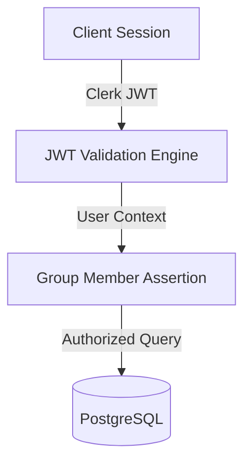

# Security Review & STRIDE Threat Modeling

This document presents a security review of the Splitr codebase, analyzing attack vectors, inputs, file upload mechanics, and a STRIDE threat assessment.

---

## 🔒 Security Architecture Overview

### 1. CSV File Ingestion Safeguards
* **File Size Boundary**: Staged CSV imports are restricted to a maximum of 500 rows (`MAX_IMPORT_ROWS = 500` inside [imports.js](file:///c:/Users/manav/OneDrive/Desktop/ai-splitwise-clone/lib/actions/imports.js)) to prevent compute resource exhaustion (Denial of Service).
* **Script Injection / XSS**: Values are parsed as plain strings, mapped to JSON key-value pairs, and stored in database cells. No text fields are ever rendered as unescaped HTML on client browsers.
* **SQL Injection (SQLi)**: All database writes and queries use Prisma ORM, which compiles query scopes using parameterized placeholders (`$1`, `$2`), preventing execution of raw database queries.

### 2. Authentication & Access Control (IDOR Mitigation)
* **Authentication**: Enforced via Clerk JWT verification on every Server Action invocation.
* **IDOR Protection**: The system implements `assertGroupMember(groupId, userId)` before accessing, updating, or committing any group resources (e.g. expenses, settlements, or imports). This blocks unauthorized users from viewing or modifying files.

---

## 📈 STRIDE Threat Model

The table below lists identified threats and their mitigation strategies in Splitr:

| Threat Category | Description / Attack Scenario | Risk Level | Mitigation Status & Strategy |
| :--- | :--- | :--- | :--- |
| **Spoofing Identity** | Attacker calls Server Actions pretending to be another registered user. | **Medium** | **Mitigated**: JWT signatures are verified by Clerk on the backend on every request. Client user IDs are derived directly from the verified session claims, not request parameters. |
| **Tampering with Data** | A member of Group A tries to modify an expense in Group B by guessing the UUID. | **High** | **Mitigated**: The `assertGroupMember` check verifies group membership boundaries in the database before completing database write transactions. |
| **Repudiation** | An owner claims they never approved a CSV import that created incorrect expenses. | **Low** | **Mitigated**: The database tracks who committed the import (`uploadedById`) and persists the `ImportReport` containing approval audit timestamps. |
| **Information Disclosure** | An unauthorized attacker attempts to download historical spending reports of a group. | **High** | **Mitigated**: Group dashboards and balance queries check group membership before returning JSON payloads. |
| **Denial of Service** | Uploading massive 1,000,000-line CSV files to exhaust backend resources. | **Medium** | **Mitigated**: The backend limits ingestion arrays to a maximum of 500 lines per file upload. |
| **Elevation of Privilege** | A standard Group Member attempts to call `commitImport` (restricted to Group Owners). | **Medium** | **Mitigated**: The group owner scope is checked by mapping the `createdByUserId` field of the `Group` model during commit executions. |
