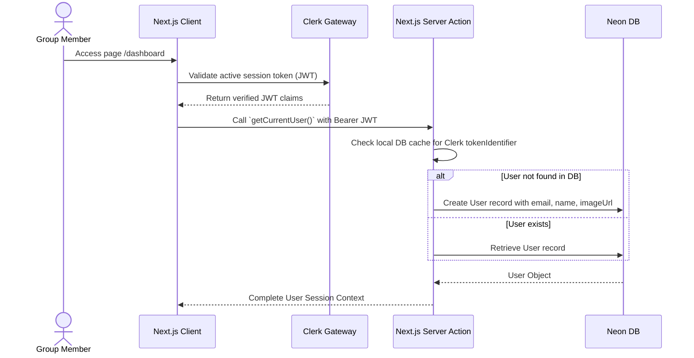
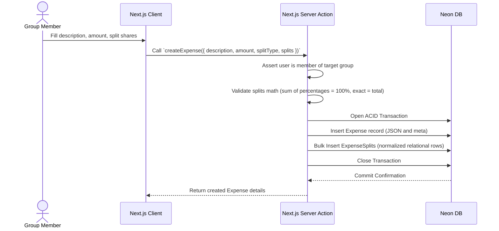
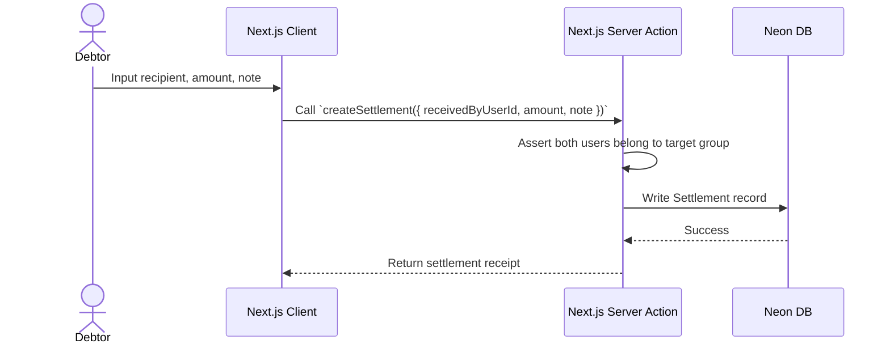
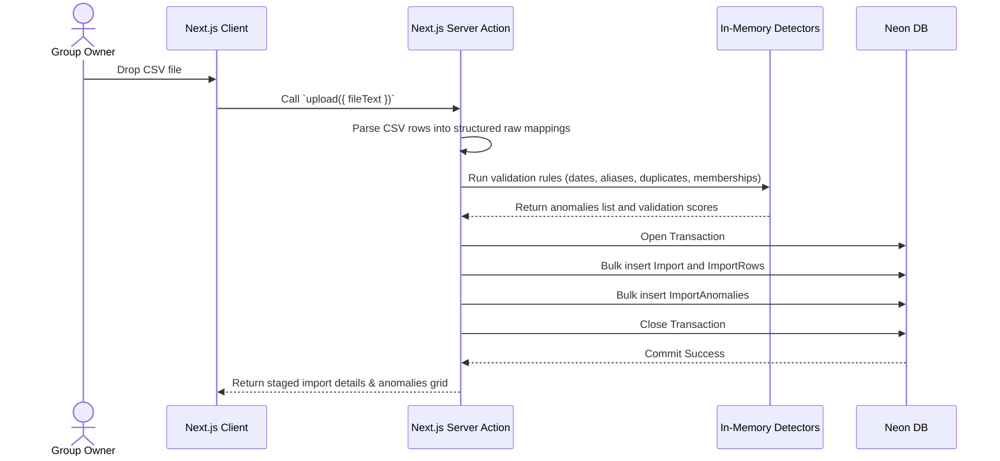
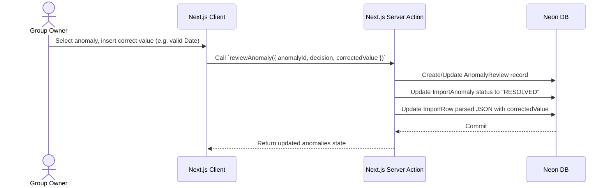
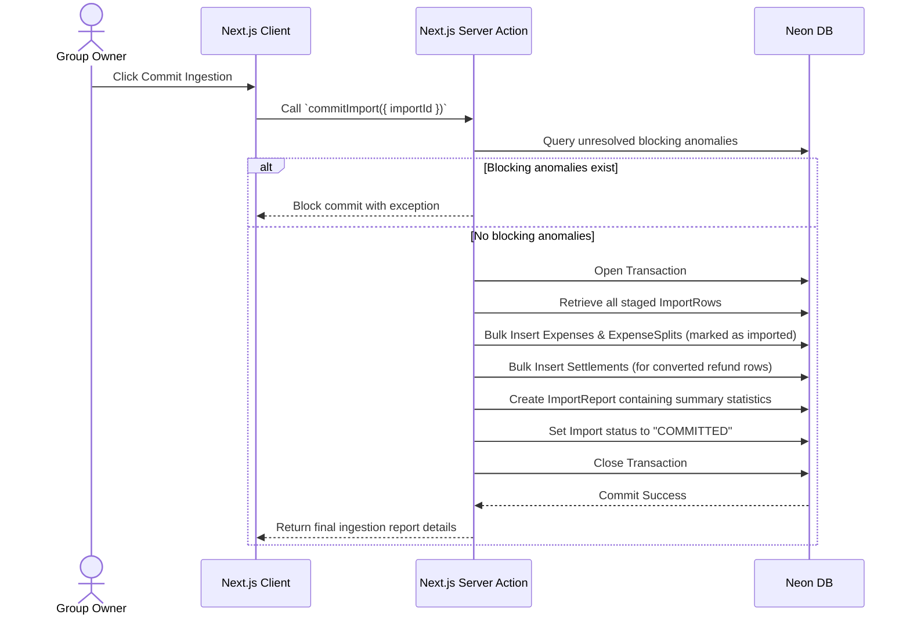

# Sequence Flow Diagrams

This document details the step-by-step sequence flows for authentication, expense creations, debt settlements, CSV ingestion pipelines, anomaly reviews, and report generation in Splitr.

---

## 🔐 1. User Login & Session Sync

---

## 💸 2. Manual Expense Creation & Split Configuration

---

## 🧾 3. Repayment Settlement Logging

---

## 📂 4. CSV Ingestion, Staging & Anomaly Flagging

---

## 🔧 5. Anomaly Review & Corrections

---

## 📊 6. Ledger Resolution & Commit Ingestion

