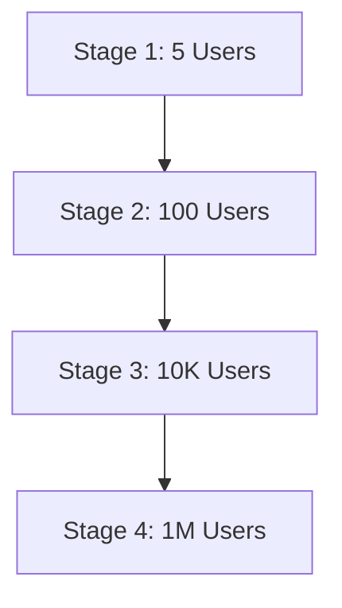

# System Design & Scaling Roadmap

This document outlines the Non-Functional Requirements (NFRs), traffic/capacity estimates, API contracts, consistency policies, failure mitigations, and the multi-phase user scaling roadmap for the Splitr platform.

---

## ⚡ Non-Functional Requirements (NFRs)

* **Latency**: 
  - Interactive page loads: <1.5s (95th percentile).
  - Write Server Actions: <500ms (95th percentile).
  - Bulk CSV Imports staging: <2.0s for files up to 500 rows.
* **Availability**: Target 99.9% uptime (excluding scheduled database maintenance).
* **Durability**: Zero data loss for committed transactions (PostgreSQL WAL streaming enabled on Neon DB).
* **Scalability**: Seamless horizontal scaling of Next.js serverless functions (Vercel) and database sizing.

---

## 📈 Capacity & Traffic Estimation

### Sizing Parameters (Targeting 10,000 Active Groups)
* **Average Group Size**: 6 members.
* **Average Expenses**: 50 manual expenses + 1 large import (200 rows) per group month.
* **Monthly Stored Rows**:
  - $10,000 \times 250 \text{ rows} = 2.5 \text{ million rows / month}$.
* **Storage Calculation (per Expense Row)**:
  - 1 row in `Expense` table (approx. 500 bytes) + 6 rows in `ExpenseSplit` (approx. 100 bytes each) = 1.1 KB per logical expense transaction.
  - $2.5 \text{ million expenses} \times 1.1 \text{ KB} = 2.75 \text{ GB / month}$ database storage growth.
* **Throughput (Peak)**:
  - Average Write Traffic: $2.5 \text{ million} / (30 \times 86400) \approx 1 \text{ transaction/sec}$.
  - Peak Write Traffic (during holiday season/weekends): $10 \text{ transactions/sec}$ (peak coefficient of 10).

---

## 🔌 API Design & Specifications

Below are the key operations mapped via Server Actions:

### 1. `getGroupBalances`
* **Input**: `groupId: String`
* **Output**:
  ```json
  {
    "balances": {
      "userId": { "paid": 1200.00, "owed": 800.00, "net": 400.00 }
    },
    "debts": [
      { "from": "user-a-uuid", "to": "user-b-uuid", "amount": 400.00 }
    ]
  }
  ```

### 2. `commitImport`
* **Input**: `importId: String`
* **Output**:
  ```json
  {
    "status": "COMMITTED",
    "importedCount": 184,
    "skippedCount": 16,
    "reportId": "report-uuid"
  }
  ```

---

## 🗃️ Data Consistency & Concurrency Control

* **Transactional Boundaries**: All balance changes and import executions run within PostgreSQL interactive transactions (`isolationLevel: 'Serializable'` or default `'ReadCommitted'` with selective row-locking `SELECT ... FOR UPDATE` where balance races are possible).
* **Idempotency**: Ingested CSV rows are tagged with unique `importRowId` strings. Re-running a commit for an already processed row blocks duplicate creations, enforcing idempotency.

---

## 🚀 Scaling Roadmap (5 to 1,000,000 Users)



### Stage 1: Individual / Single Group (5 Users)
* **Architecture**: Serverless Next.js (Vercel) + Free-tier Serverless Neon DB.
* **Characteristics**: Development environments, local execution. Latency is dominated by WAN connection time.

### Stage 2: Small Community / Shared Trips (100 Users)
* **Architecture**: Single active serverless compute region + Standard Neon DB instance.
* **Optimization**: Pre-seeding exchange rates inside local node memory to avoid DB lookups.

### Stage 3: Professional Scale (10,000 Users)
* **Architecture**: Serverless Vercel with edge caching enabled. Neon DB upgraded to a dedicated tier (4+ CPU cores) to prevent connection timeouts.
* **Optimization**:
  - Offloading CSV staging validations to Inngest background workers instead of synchronous API handlers.
  - Introducing Redis cache layer (e.g. Upstash) for reading pre-compiled group netting balances.

### Stage 4: Global SaaS Scale (1,000,000 Users)
* **Architecture**: Multi-region Next.js deployments on Vercel with database replication.
* **Data Layer Plan**:
  - Sharding PostgreSQL tables by `groupId`. Since groups are independent collaborative contexts, transactions never span across different groups.
  - Static asset distribution via a global CDN.
  - Dedicated message queues (e.g., Apache Kafka or AWS SQS) for importing massive CSV batches.
