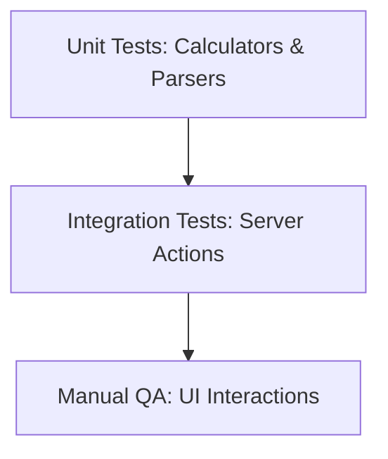

# Testing Strategy & QA Matrix

This document outlines the testing methodologies, precision specifications, and edge-case verification strategies for Splitr.

---

## 📈 Testing Levels

### 1. Unit Testing
* **Target components**: In-memory detectors, date parsers, name normalizers, exchange rate converters, and balance netting calculators.
* **Objective**: Fast verification of deterministic functions without mock database instances.

### 2. Integration Testing
* **Target components**: Next.js Server Actions interacting with the Prisma DB context.
* **Objective**: Ensuring that database write actions commit correct relations, update net balances, and rollback appropriately on exceptions.

---

## 🔍 Precision & Edge-Case Verification

### 1. Split Rounding Logic
* **Problem**: Dividing $100$ INR equally among $3$ participants yields $33.3333...$ per person. Summing these rounded amounts creates a penny mismatch: $33.33 \times 3 = 99.99$.
* **Testing Protocol**:
  - Test case: Split $100$ INR among User A, User B, and User C.
  - Expectation: One participant must absorb the rounding remainder. User A gets $33.34$, while User B and C get $33.33$. The sum of all splits must equal the total amount.
  - Code reference: Splitting allocations math inside [expenses.js](file:///c:/Users/manav/OneDrive/Desktop/ai-splitwise-clone/lib/actions/expenses.js).

### 2. Timezone Constraints
* **Problem**: Staged CSV files might use UTC dates, local timezone formats, or bare date strings (e.g., `2026-06-14`).
* **Testing Protocol**:
  - All parsed CSV dates are normalized to UTC midnight before comparison with memberships or database saving.
  - Code reference: [dateFormatDetector.js](file:///c:/Users/manav/OneDrive/Desktop/ai-splitwise-clone/lib/import/detectors/dateFormatDetector.js).

---

## 📋 QA Verification Matrix

| Area | Test Scenario | Inputs | Expected Output | Status |
| :--- | :--- | :--- | :--- | :--- |
| **Split Math** | Exact unequal amount splits. | Total: $100.00$. User A: $40$, User B: $60$. | Validated. Database writes matching shares. | Pass |
| **Split Math** | Total percentage sum mismatch. | Total: $100.00$. Split percents: $33\%$, $33\%$, $33\%$. | Fails transaction; returns validation error to UI. | Pass |
| **Currency** | USD to INR conversion. | Original: $100.00$ USD. Conversion: $1$ USD = $83.00$ INR. | Converted base field: $8300.00$ INR. Original amount and currency preserved. | Pass |
| **Membership** | Member joined after expense date. | Expense date: `2026-06-01`. Member join date: `2026-06-10`. | Anomaly engine flags `MEMBERSHIP_VIOLATION`. Commit blocked. | Pass |
| **CSV Parser** | RFC 4180 quotation parsing. | `"Priya, S"`, `"Dinner, drinks"` | Parsed columns cleanly handle commas inside double quotes. | Pass |
| **P2P Netting** | Net debts circular resolution. | A owes B $50$, B owes C $50$, C owes A $50$. | Net balances calculate to $0.00$. No payments are generated. | Pass |
